# QUY TẮC BẮT BUỘC VỀ THIẾT KẾ VÀ PHÁT TRIỂN GIAO DIỆN (UI/UX & ART DIRECTION RULES)

## 1. Nguyên Tắc Cốt Lõi (Core Principles)
- **Tuân thủ Tuyệt đối Art Direction Guide:** Khi triển khai bất kỳ mã nguồn giao diện (HTML/CSS/JSX/Tailwind), linh kiện (Component) hoặc trang (Page) nào trong Frontend, AI **BẮT BUỘC PHẢI TUÂN THỦ 100%** tài liệu đặc tả nghệ thuật tại:
  - [art-direction-guide.md](file:///d:/PersonaPropjects/Feed/The/Kurumeo/feed-the-kraken/spec/features/007-frontend-ui-revamp/art-direction-guide.md)
  - Toàn bộ hồ sơ đặc tả Feature 007 (`spec.md`, `entities/ENT-007-Theme-Tokens.md`, `UC-021`, `UC-022`, `UC-023`).
  - Kế hoạch triển khai (Implementation Plan / Phase 9 trong `task.md`).
- **Triết lý Thẩm mỹ "Eldritch Parchment":** Ngôn ngữ thiết kế chủ đạo là sự hòa trộn giữa **Don't Starve Together × Lovecraftian Sea Horror × Gothic Sketchbook** (Ánh nến trong vực thẳm đại dương, bề mặt gỗ mục phong hóa, giấy da dê cổ ố vàng, điểm xuyết sắc xanh rêu verdigris/moss).

---

## 2. Các Ràng Buộc Thị Giác Bắt Buộc (Mandatory Visual Constraints)

### 2.1 Bảng Màu & Ánh Sáng (Palette & Lighting)
- **Palette nền tảng:** Sử dụng chuẩn mã màu `--abyss` (`#0A0A08`), `--hull-dark` (`#1A1510`), `--hull` (`#2A2118`), `--hull-light` (`#3D3228`), `--parchment` (`#D4C5A0`), `--parchment-dim` (`#9B8E72`), `--parchment-bright` (`#F0E6CC`).
- **Sắc xanh phong hóa (Verdigris & Moss):** Sử dụng `--verdigris` (`#4A7A6A`), `--verdigris-glow` (`#6BA89A`), `--moss` (`#3A5A3A`), `--seaweed` (`#5A8A5A`) cho các chi tiết biển, viền rêu, và indicator trạng thái.
- **Sắc phe phái cổ xưa:** Sailor (`#4A7A8C`), Pirate (`#A83B2A`), Cult (`#6B3FA0`) phải mang cảm giác bột màu cổ/mực phai, tuyệt đối không dùng màu neon.
- **Ánh sáng:** Tương phản cực mạnh giữa ánh sáng ấm (nến/lửa `--firelight` `#E8A63E`, `--gold` `#C9A84C`) và bóng tối bao quanh.
- **Vignette:** Bắt buộc áp dụng lớp phủ tối viền toàn cục (global dark vignette) trên toàn bộ viewport.

### 2.2 Kiểu Chữ (Typography)
- **Display / Game Title:** `'Pirata One'`, `'Georgia'`, `serif` — Gothic hải tặc.
- **Heading / Phase / Role Names:** `'Cinzel'`, `'Times New Roman'`, `serif` — Cổ điển La Mã trang trọng.
- **Body / Status / Buttons:** `'Outfit'`, `sans-serif` — Hiện đại sắc nét, dễ đọc.
- **Cấm:** Không dùng font mặc định browser hoặc các font hiện đại trơn lùi (như Inter, Roboto, Arial, Helvetica) cho tiêu đề/heading.

### 2.3 Chất Liệu Bề Mặt (Surfaces & Textures)
- **Không bao giờ phẳng lì:** Mọi panel, card, input và modal phải có texture bề mặt (thớ gỗ mục `.panel-wood`, da dê cổ sần sùi `.card-parchment`, vệt ố `.aged-stain`, đinh sắt gỉ).
- **Corner Radius:** Sử dụng góc sắc/thô (`rounded` 4px hoặc `rounded-sm` 2px). Nút bấm tối đa `rounded-md` (6px).

### 2.4 Chuyển Động & Hiệu Ứng (Motion & Effects)
- Chuyển động phải nặng nề, chậm rãi, có trọng lượng (như tàu dập dềnh `shipBob`, lật thẻ 3D `600ms`, rung nổ súng `gunShake`, lửa chập chờn `candleFlicker`).
- Tuân thủ khả năng tiếp cận (`prefers-reduced-motion` phải tắt các hoạt cảnh rung lắc hoặc 3D phức tạp).

---

## 3. Danh Sách Nghiêm Cấm Tuyệt Đối (Strict DON'Ts)

1. ❌ **CẤM Glassmorphism / Backdrop-blur bóng bẩy kiểu Apple / Linear.**
2. ❌ **CẤM Màu Gradient Neon AI mặc định (tím xanh rực rỡ).**
3. ❌ **CẤM Góc bo tròn lớn (`rounded-2xl`, `rounded-3xl`, `rounded-full` cho card/panel).**
4. ❌ **CẤM Màu trắng tinh khiết (`#FFFFFF`)** — Màu sáng nhất cho phép là `--parchment-bright` (`#F0E6CC`).
5. ❌ **CẤM Chấm trạng thái xanh lá cây neon** — Bắt buộc dùng `--verdigris` (`#4A7A6A`).
6. ❌ **CẤM Animation nảy lò xo (bouncy/spring)** — Chuyển động phải có độ trễ và sức nặng.
7. ❌ **CẤM Bề mặt đơn sắc phẳng lì không có texture/chiều sâu.**

---

---

---

## 4. QUY TRÌNH THỰC HIỆN TASK GIAO DIỆN & KÍCH HOẠT SKILLS (UI REVAMP SOP & SKILLS MAPPING)

Các task trong `task.md` được phân loại thành 2 luồng thực thi rõ ràng, mỗi bước đều kích hoạt các bộ Kỹ năng (Skills) chuyên biệt:

```mermaid
flowchart TD
    subgraph Track_A["Track A: Task Nền tảng & Hạ tầng Theme (T048 - T051, T056 - T057)"]
        A1["Bước A1: Báo cáo Đề xuất Tokens & Art Style<br/><i>[stitch-design-taste, high-end-visual-design, gpt-taste]</i>"] --> A2["Bước A2: Trao đổi & Chốt với User 🎯<br/><i>[Human Gatekeeper]</i>"]
        A2 --> A3["Bước A3: Cập nhật Code Nền tảng<br/><i>[full-output-enforcement, stitch-design-taste]</i>"]
        A3 --> A4["Bước A4: Kiểm tra Compilation & Font Loading<br/><i>[design-taste-frontend]</i>"]
        A4 --> A5["Bước A5: Cập nhật task.md & Đề xuất Git Commit<br/><i>[speckit-implement, rule-git-workflow]</i>"]
    end

    subgraph Track_B["Track B: Task Trang & Linh kiện UI Cụ thể (T052 - T055, T058 - T066)"]
        B1["Bước B1: Generate Mockup & Trao đổi Chốt với User 🎯<br/><i>[imagegen-frontend-web, imagegen-frontend-mobile, image-to-code, brandkit]</i>"] --> B2["Bước B2: Bóc tách & Sinh Bộ Asset Đồ họa Custom<br/><i>[image-to-code, brandkit]</i>"]
        B2 --> B3["Bước B3: Lưu trữ & Tổ chức Asset Khoa học<br/><i>[Asset Directory Structure]</i>"]
        B3 --> B4["Bước B4: Code Component & Kỹ thuật Ghép Layer<br/><i>[image-to-code, redesign-existing-projects, gpt-taste, full-output-enforcement]</i>"]
        B4 --> B5["Bước B5: Thẩm định Trực quan 1:1 & Build Check<br/><i>[design-taste-frontend, image-to-code]</i>"]
        B5 --> B6["Bước B6: Cập nhật task.md & Đề xuất Git Commit<br/><i>[speckit-implement, rule-git-workflow]</i>"]
    end
```

---

### 🅰️ TRACK A: Dành cho Task Nền tảng / Hạ tầng Theme (T048 - T051, T056 - T057)

#### 1. Bước A1 - Báo cáo Đề xuất Hệ thống Tokens & Art Style
- **Skills kích hoạt:**
  - `stitch-design-taste`: Thiết kế bảng Design Tokens ngữ nghĩa (Semantic Tokens), phân bổ bảng màu HSL/HEX cổ điển (`--abyss`, `--hull`, `--parchment`, `--verdigris`, `--sailor`, `--pirate`, `--cult`), xây dựng hệ thống phân cấp Typography 3 tầng (`Pirata One`, `Cinzel`, `Outfit`).
  - `high-end-visual-design`: Thiết lập tiêu chuẩn thẩm mỹ cao cấp (chống giao diện generic AI, định nghĩa độ sâu `boxShadow.wood`, `boxShadow.parchment`, quy chuẩn bo góc sắc cạnh thô mộc `rounded-sm` / `rounded`).
  - `gpt-taste`: Định nghĩa các keyframes chuyển động vật lý có sức nặng (`candleFlicker`, `gunShake`, `shipBob`, `eldritchPulse`, `dustDrift`).
- **Hành động:** Trình bày chi tiết bảng thông số Tokens & Typography vào chat cho User đánh giá.

#### 2. Bước A2 - Trao đổi & Chốt với User (CỔNG CHẶN 🎯)
- **Hành động:** Lắng nghe góp ý của User về màu sắc/font chữ. **CHỈ KHI USER CHÍNH THỨC DUYỆT** mới chuyển sang Bước A3.

#### 3. Bước A3 - Cập nhật Code Nền tảng (Implementation)
- **Skills kích hoạt:**
  - `full-output-enforcement`: Đảm bảo viết đầy đủ 100% tokens, keyframes, font preconnects và utilities trong `tailwind.config.js`, `index.html`, `index.css`, `App.css`, không dùng comment rút gọn hay placeholder.
- **Hành động:** Thực hiện cập nhật mã nguồn theo đúng các tokens đã duyệt.

#### 4. Bước A4 - Kiểm tra Build & Font Loading
- **Skills kích hoạt:**
  - `design-taste-frontend` (Pre-flight Audit): Kiểm tra hệ thống tokens CSS biên dịch sạch, fonts load mượt mà, `npm run build` thành công 0 lỗi.

#### 5. Bước A5 - Cập nhật task.md & Git Workflow
- **Skills/Rules kích hoạt:**
  - `speckit-implement`: Cập nhật `[x]` trong `task.md`.
  - `rule-git-workflow.md`: Soạn commit message chuẩn Conventional Commits và xin phép User trước khi commit/push.

---

### 🅱️ TRACK B: Dành cho Task Trang & Linh kiện UI Cụ thể (T052 - T055, T058 - T066)

#### 1. Bước B1 - Khởi tạo Mockup & Trao đổi Chốt Thiết kế (CỔNG CHẶN 🎯)
- **Skills kích hoạt:**
  - `imagegen-frontend-web` / `imagegen-frontend-mobile`: Tạo hình ảnh Mockup chi tiết cho từng trang/thành phần cụ thể, xây dựng bố cục AIDA, phân bổ ánh sáng firelight tương phản bóng tối abyss, thể hiện chất liệu gỗ nứt và da dê mép rách.
  - `image-to-code` (Phase Mockup Reference): Đảm bảo hình ảnh render ở kích thước lớn, rõ nét, có độ chi tiết cao để phục vụ bóc tách sau này.
  - `brandkit`: Định hướng nhận diện thương hiệu game (logo gothic, hoa tiêu la bàn, ấn ký Tà thần Kraken).
- **Hành động:** Xuất trình hình ảnh Mockup cho User xem, phân tích bố cục và nhận feedback chỉnh sửa. **CHỈ KHI USER CHÍNH THỨC DUYỆT BẢN MOCKUP** mới chuyển sang Bước B2.

#### 2. Bước B2 - Bóc tách & Sinh Bộ Tài nguyên Đồ họa (Asset Generation & Slicing)
- **Skills kích hoạt:**
  - `image-to-code` (Asset Extraction): Bóc tách các thành phần độc bản từ Mockup đã chốt và dùng `generate_image` để tạo các file asset đồ họa riêng biệt:
    - *Textures/Frames:* Tấm da dê mép rách hữu cơ, khung ván gỗ sồi nứt, khay rãnh gỗ input, phiến gỗ button...
    - *Decorations/Sprites:* Sprite cặp nến cháy phát sáng firelight, bóng xúc tu, vương miện gỉ, la bàn...
    - *Cards/Badges:* Khung bài Tarot viền vàng cổ, huy hiệu các phe Thủy thủ / Hải tặc / Tà giáo...
  - `brandkit`: Chuẩn hóa chất liệu và tone màu giữa các asset để đảm bảo tính đồng bộ nhận diện.

#### 3. Bước B3 - Lưu trữ & Tổ chức Asset Khoa học
- **Hành động:** Xuất và lưu trữ toàn bộ asset vào đúng phân mục:
  `frontend/src/assets/ui/` (`backgrounds/`, `frames/`, `buttons/`, `sprites/`, `cards/`).

#### 4. Bước B4 - Code Component & Kỹ thuật Ghép Layer (Component Layering)
- **Skills kích hoạt:**
  - `image-to-code` (Deep Image Translation): Phân tích sâu các chi tiết trong Mockup đã chốt (khoảng cách padding/margin, font scale, độ nổi khối) và chuyển ngữ sang React JSX + CSS layered textures.
  - `redesign-existing-projects`: Nâng cấp giao diện component hiện có mà **KHÔNG PHÁ VỠ GAME LOGIC**, bảo toàn 100% state React, Socket.io event listeners và props interface.
  - `gpt-taste`: Tích hợp micro-interactions, hiệu ứng hover button nổi khối, animation ánh nến chập chờn (`candleFlicker`), bụi tro bay (`dustDrift`).
  - `full-output-enforcement`: Xuất toàn bộ mã nguồn component hoàn chỉnh, tuyệt đối không dùng placeholder `/* ... */`.

#### 5. Bước B5 - Thẩm định Trực quan 1:1 & Build Check
- **Skills kích hoạt:**
  - `image-to-code` (Visual Fidelity Audit): Soi chiếu 1:1 giữa giao diện web thực tế và bản Mockup đã chốt ở Bước B1 (đảm bảo mép giấy rách, vân gỗ nứt và quầng sáng nến hiển thị sống động).
  - `design-taste-frontend` (Pre-flight Audit): Kiểm tra responsive trên mọi kích thước (Mobile 375px đến Desktop 1920px+), zero horizontal overflow, hiệu năng đạt 60 FPS, độ tương phản văn bản đạt chuẩn WCAG AA.
- **Hành động:** Chạy `npm run build` trong `frontend/` xác nhận 0 lỗi compile.

#### 6. Bước B6 - Cập nhật Tiến độ & Đề xuất Git Workflow
- **Skills/Rules kích hoạt:**
  - `speckit-implement`: Đánh dấu hoàn thành task trong `task.md`.
  - `rule-code-quality.md`: Xuất báo cáo Self-Review Report.
  - `rule-git-workflow.md`: Soạn commit message chuẩn Conventional Commits và xin phép User trước khi commit/push.

---

## 5. Danh Sách Nghiêm Cấm Tuyệt Đối (Strict DON'Ts)

1. ❌ **CẤM Tự ý code giao diện khi chưa có Mockup (Track B) hoặc Bản đề xuất Token (Track A) được User duyệt và chốt.**
2. ❌ **CẤM Chỉ dùng CSS thuần (border, box-shadow) để giả lập chất liệu hữu cơ (mép giấy rách, vân gỗ nứt, ngọn nến) mà không qua Asset Generation.**
3. ❌ **CẤM Glassmorphism / Backdrop-blur bóng bẩy kiểu Apple / Linear.**
4. ❌ **CẤM Màu Gradient Neon AI mặc định (tím xanh rực rỡ).**
5. ❌ **CẤM Góc bo tròn lớn (`rounded-2xl`, `rounded-3xl`, `rounded-full` cho card/panel).**
6. ❌ **CẤM Màu trắng tinh khiết (`#FFFFFF`)** — Màu sáng nhất cho phép là `--parchment-bright` (`#F0E6CC`).
7. ❌ **CẤM Chấm trạng thái xanh lá cây neon** — Bắt buộc dùng `--verdigris` (`#4A7A6A`).
8. ❌ **CẤM Animation nảy lò xo (bouncy/spring)** — Chuyển động phải có độ trễ và sức nặng.
9. ❌ **CẤM Bề mặt đơn sắc phẳng lì không có texture/chiều sâu.**

