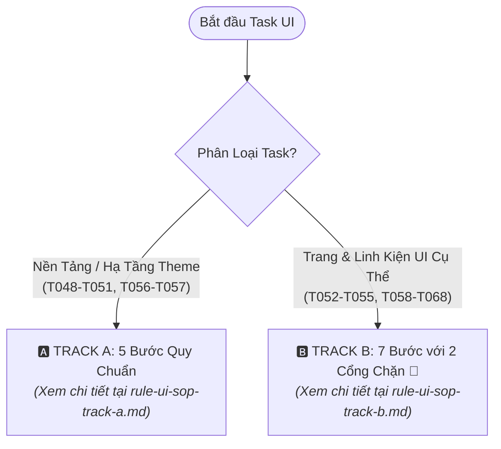

# QUY TRÌNH THỰC HIỆN TASK GIAO DIỆN & KÍCH HOẠT SKILLS (MASTER SOP INDEX)

Tài liệu này là chỉ mục tổng hợp điều hướng toàn bộ quy trình chuẩn (SOP) phân loại 2 luồng thực thi (Track A & Track B) cho các Task giao diện trong dự án Feed The Kraken.

---

## 1. Bảng Phân Tuyến & Liên Kết Tài Liệu Chi Tiết

| Phân Tuyến | Đối Tượng Áp Dụng | Đặc Điểm Quy Trình | Tài Liệu Quy Chuẩn Chi Tiết |
| :--- | :--- | :--- | :--- |
| **Track A** | Các task nền tảng CSS, Tokens, Palette, Fonts, Audio Hooks (`T048` - `T051`, `T056` - `T057`) | Quy trình 5 bước: Đề xuất Tokens ➔ Chốt với User ➔ Code nền tảng ➔ Build check ➔ Git workflow | 📄 [rule-ui-sop-track-a.md](file:///d:/PersonaPropjects/Feed/The/Kurumeo/feed-the-kraken/.agents/rules/rule-ui-sop-track-a.md) |
| **Track B** | Toàn bộ màn hình và component game cụ thể: Lobby, Cards, Tabletop, HUD, Drawer, Map, Phase, Modals (`T052` - `T055`, `T058` - `T068`) | Quy trình 7 bước nghiêm ngặt với 2 Cổng chặn (Gatekeeper 1: Chốt Kế hoạch Layer/Asset; Gatekeeper 2: Chốt Mockup Visual), bóc tách PNG trong suốt | 📄 [rule-ui-sop-track-b.md](file:///d:/PersonaPropjects/Feed/The/Kurumeo/feed-the-kraken/.agents/rules/rule-ui-sop-track-b.md) |

---

## 2. Các Nguyên Tắc Cốt Lõi Bất Di Bất Dịch (Immutable Rules)

1. **Tuân thủ tuần tự từng bước (No Skipping):** Tuyệt đối không nhảy cóc hoặc làm gộp các bước (ví dụ: nhảy từ Bước 3 sang code Bước 5 khi User chưa duyệt bộ Asset).
2. **Cơ chế 2 Cổng chặn bắt buộc (Dual Gatekeepers):**
   - *Cổng chặn 1 (Sau Bước B1):* Dừng lại chờ User duyệt Bản đồ phân tầng & Ma trận Asset.
   - *Cổng chặn 2 (Sau Bước B2):* Dừng lại chờ User duyệt hình ảnh Mockup.
3. **Nghiêm cấm nướng chết chữ và nút vào ảnh:** Mọi tiêu đề, nhãn, nút bấm, ô input bắt buộc render bằng React JSX với font `Pirata One`.
4. **Khởi tạo Asset độc lập, Cấm cắt cúp lười biếng từ Mockup:** Bề mặt nền phải sạch bóng đạo cụ (Clean Canvas); mọi prop/sprite tương tác có Z-Index riêng (cuộn giấy trigger, súng, thẻ bài, tay nắm) bắt buộc sinh riêng lẻ từ đầu trên nền trung tính trước khi tách alpha.
5. **Tách phông PNG trong suốt hoàn toàn:** Mọi asset nguyên tử dạng props/sprites/frames phải được tách nền sạch sẽ (kênh Alpha), không còn viền đen hay hộp đen bao quanh.
6. **100% Tiếng Anh (English Display Language):** Mọi text, label, thông điệp hệ thống trên giao diện hiển thị 100% tiếng Anh mang phong cách hàng hải cổ điển.
