# QUY TRÌNH THỰC HIỆN TASK GIAO DIỆN & KÍCH HOẠT SKILLS (UI REVAMP SOP & SKILLS MAPPING)

Tài liệu này định nghĩa quy trình chuẩn (SOP) phân loại 2 luồng thực thi (Track A & Track B) cho toàn bộ các Task giao diện trong dự án Feed The Kraken, kèm ma trận kích hoạt Kỹ năng (Skills Mapping) tương ứng cho từng bước.

```mermaid
flowchart TD
    subgraph Track_A["Track A: Task Nền tảng & Hạ tầng Theme (T048 - T051, T056 - T057)"]
        A1["Bước A1: Báo cáo Đề xuất Tokens & Art Style<br/><i>[stitch-design-taste, high-end-visual-design, gpt-taste]</i>"] --> A2["Bước A2: Trao đổi & Chốt với User 🎯<br/><i>[Human Gatekeeper]</i>"]
        A2 --> A3["Bước A3: Cập nhật Code Nền tảng<br/><i>[full-output-enforcement, stitch-design-taste]</i>"]
        A3 --> A4["Bước A4: Kiểm tra Compilation & Font Loading<br/><i>[design-taste-frontend]</i>"]
        A4 --> A5["Bước A5: Cập nhật task.md & Đề xuất Git Commit<br/><i>[speckit-implement, rule-git-workflow]</i>"]
    end

    subgraph Track_B["Track B: Task Trang & Linh kiện UI Cụ thể (T052 - T055, T058 - T066)"]
        B1["Bước B1: Generate Mockup & Trao đổi Chốt với User 🎯<br/><i>[imagegen-frontend-web, imagegen-frontend-mobile, image-to-code, brandkit]</i>"] --> B2["Bước B2: Bóc tách, Tách Phông & Sinh Bộ Asset Đồ họa Custom<br/><i>[image-to-code, brandkit, scripts/remove_background.py]</i>"]
        B2 --> B3["Bước B3: Lưu trữ & Tổ chức Asset Khoa học<br/><i>[frontend/src/assets/ui/]</i>"]
        B3 --> B4["Bước B4: Code Component & Kỹ thuật Ghép Layer<br/><i>[image-to-code, redesign-existing-projects, gpt-taste, full-output-enforcement]</i>"]
        B4 --> B5["Bước B5: Thẩm định Trực quan 1:1 & Build Check<br/><i>[design-taste-frontend, image-to-code]</i>"]
        B5 --> B6["Bước B6: Cập nhật task.md & Đề xuất Git Commit<br/><i>[speckit-implement, rule-git-workflow]</i>"]
    end
```

---

## 🅰️ TRACK A: Dành cho Task Nền tảng / Hạ tầng Theme (T048 - T051, T056 - T057)

### 1. Bước A1 - Báo cáo Đề xuất Hệ thống Tokens & Art Style
- **Skills kích hoạt:**
  - `stitch-design-taste`: Thiết kế bảng Design Tokens ngữ nghĩa (Semantic Tokens), phân bổ bảng màu HSL/HEX cổ điển (`--abyss`, `--hull`, `--parchment`, `--verdigris`, `--sailor`, `--pirate`, `--cult`), xây dựng hệ thống Typography đồng bộ font `'Pirata One'`.
  - `high-end-visual-design`: Thiết lập tiêu chuẩn thẩm mỹ cao cấp (chống giao diện generic AI, định nghĩa độ sâu `boxShadow.wood`, `boxShadow.parchment`, quy chuẩn bo góc sắc cạnh thô mộc `rounded-sm` / `rounded`).
  - `gpt-taste`: Định nghĩa các keyframes chuyển động vật lý có sức nặng (`candleFlicker`, `gunShake`, `shipBob`, `eldritchPulse`, `dustDrift`).
- **Hành động:** Trình bày chi tiết bảng thông số Tokens & Typography vào chat cho User đánh giá.

### 2. Bước A2 - Trao đổi & Chốt với User (CỔNG CHẶN 🎯)
- **Hành động:** Lắng nghe góp ý của User về màu sắc/font chữ. **CHỈ KHI USER CHÍNH THỨC DUYỆT** mới chuyển sang Bước A3.

### 3. Bước A3 - Cập nhật Code Nền tảng (Implementation)
- **Skills kích hoạt:**
  - `full-output-enforcement`: Đảm bảo viết đầy đủ 100% tokens, keyframes, font preconnects và utilities trong `tailwind.config.js`, `index.html`, `index.css`, `App.css`, không dùng comment rút gọn hay placeholder.
- **Hành động:** Thực hiện cập nhật mã nguồn theo đúng các tokens đã duyệt.

### 4. Bước A4 - Kiểm tra Build & Font Loading
- **Skills kích hoạt:**
  - `design-taste-frontend` (Pre-flight Audit): Kiểm tra hệ thống tokens CSS biên dịch sạch, fonts load mượt mà, `npm run build` thành công 0 lỗi.

### 5. Bước A5 - Cập nhật task.md & Git Workflow
- **Skills/Rules kích hoạt:**
  - `speckit-implement`: Cập nhật `[x]` trong `task.md`.
  - `rule-git-workflow.md`: Soạn commit message chuẩn Conventional Commits và xin phép User trước khi commit/push.

---

## 🅱️ TRACK B: Dành cho Task Trang & Linh kiện UI Cụ thể (T052 - T055, T058 - T066)

### 1. Bước B1 - Khởi tạo Mockup & Trao đổi Chốt Thiết kế (CỔNG CHẶN 🎯)
- **Skills kích hoạt:**
  - `imagegen-frontend-web` / `imagegen-frontend-mobile`: Tạo hình ảnh Mockup chi tiết cho từng trang/thành phần cụ thể, xây dựng bố cục AIDA, phân bổ ánh sáng firelight tương phản bóng tối abyss, thể hiện chất liệu gỗ nứt và da dê mép rách.
  - `image-to-code` (Phase Mockup Reference): Đảm bảo hình ảnh render ở kích thước lớn, rõ nét, có độ chi tiết cao để phục vụ bóc tách sau này.
  - `brandkit`: Định hướng nhận diện thương hiệu game (logo gothic, hoa tiêu la bàn, ấn ký Tà thần Kraken).
- **Hành động:** Xuất trình hình ảnh Mockup cho User xem, phân tích bố cục và nhận feedback chỉnh sửa. **CHỈ KHI USER CHÍNH THỨC DUYỆT BẢN MOCKUP** mới chuyển sang Bước B2.

### 2. Bước B2 - Bóc tách, Tách Phông & Sinh Bộ Asset Đồ họa Nguyên tử (Atomic Asset Generation & Decomposition)
- **Quy trình Phân tích Phân rã Component Đa tầng (BẮT BUỘC):**
  Trước khi sinh asset, AI bắt buộc phải phân tích cây cấu trúc linh kiện từ Mockup từ ngoài vào trong:
  - *Khối nền / Khung chứa cha:* Bệ gỗ sồi trơn (`PanelWood`), Tấm cuộn da dê trơn (`CardParchment`).
  - *Linh kiện con nguyên tử (Atomic Elements):* Khay rãnh gỗ input trơn (`input_wood_slot.png`), Nhãn tag da dê trơn (`tag_parchment_label.png`), Phiến nút bấm trơn (`button_gold.png`, `button_wood.png`), Sprite nến rời (`candle_prop.png`).
- **NGHIÊM CẤM TẠO ẢNH GỘP NƯỚNG CHẾT (STRICT BAN ON PRE-BAKED MONOLITHIC ASSETS):**
  - **TUYỆT ĐỐI CẤM** hành vi tạo một tấm ảnh lớn chứa sẵn tiêu đề, ô nhập liệu, tên nhãn, nút bấm hay nến cháy nướng chết chung vào một hình để dùng cho nhanh.
  - Mọi chữ viết (Game Title, Heading, Subtitle, Labels, Button text) **BẮT BUỘC PHẢI RENDER BẰNG CODE REACT/HTML THẬT** với font `Pirata One`.
  - Mọi ô input và button phải được ghép từ các component độc lập (`<InputPlank>`, `<ButtonWood>`).
- **QUY ĐỊNH BẮT BUỘC VỀ XÓA PHÔNG (TRANSPARENT PNG):**
  - Mọi file asset đồ họa UI sau khi sinh **BẮT BUỘC PHẢI ĐƯỢC TÁCH NỀN THÀNH PNG TRONG SUỐT (Transparent PNG với kênh Alpha sạch)** bằng script `scripts/remove_background.py` trước khi nạp vào mã nguồn. Tuyệt đối không để lại viền đen/hộp đen bao quanh.
- **Skills kích hoạt:**
  - `image-to-code` (Asset Decomposition & Slicing).
  - `brandkit`: Chuẩn hóa chất liệu và tone màu giữa các asset để đảm bảo tính đồng bộ nhận diện.

### 3. Bước B3 - Lưu trữ & Tổ chức Asset Khoa học
- **Hành động:** Xuất và lưu trữ toàn bộ file PNG nguyên tử trong suốt vào đúng phân mục:
  `frontend/src/assets/ui/` (`backgrounds/`, `frames/`, `buttons/`, `sprites/`, `cards/`).

### 4. Bước B4 - Code Component & Kỹ thuật Ghép Layer (Component Layering)
- **Skills kích hoạt:**
  - `image-to-code` (Deep Image Translation): Phân tích sâu các chi tiết trong Mockup đã chốt (khoảng cách padding/margin, font scale, độ nổi khối) và chuyển ngữ sang React JSX + CSS layered textures.
  - `redesign-existing-projects`: Nâng cấp giao diện component hiện có mà **KHÔNG PHÁ VỠ GAME LOGIC**, bảo toàn 100% state React, Socket.io event listeners và props interface.
  - `gpt-taste`: Tích hợp micro-interactions, hiệu ứng hover button nổi khối, animation ánh nến chập chờn (`candleFlicker`), bụi tro bay (`dustDrift`).
  - `full-output-enforcement`: Xuất toàn bộ mã nguồn component hoàn chỉnh, tuyệt đối không dùng placeholder `/* ... */`.

### 5. Bước B5 - Thẩm định Trực quan 1:1 & Build Check
- **Skills kích hoạt:**
  - `image-to-code` (Visual Fidelity Audit): Soi chiếu 1:1 giữa giao diện web thực tế và bản Mockup đã chốt ở Bước B1 (đảm bảo mép giấy rách, vân gỗ nứt và quầng sáng nến hiển thị sống động).
  - `design-taste-frontend` (Pre-flight Audit): Kiểm tra responsive trên mọi kích thước (Mobile 375px đến Desktop 1920px+), zero horizontal overflow, hiệu năng đạt 60 FPS, độ tương phản văn bản đạt chuẩn WCAG AA.
- **Hành động:** Chạy `npm run build` trong `frontend/` xác nhận 0 lỗi compile.

### 6. Bước B6 - Cập nhật Tiến độ & Đề xuất Git Workflow
- **Skills/Rules kích hoạt:**
  - `speckit-implement`: Đánh dấu hoàn thành task trong `task.md`.
  - `rule-code-quality.md`: Xuất báo cáo Self-Review Report.
  - `rule-git-workflow.md`: Soạn commit message chuẩn Conventional Commits và xin phép User trước khi commit/push.
