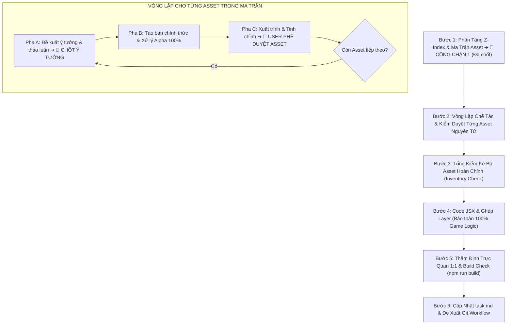

# QUY TRÌNH THỰC HIỆN GIAO DIỆN CHUYÊN BIỆT CHO TASK T063
# (CAPTAIN'S TABLETOP ENVIRONMENT & UNDER-DRAWER SOP)

Tài liệu quy trình chuẩn (SOP) chuyên biệt dành riêng cho **Task T063 [BR-007]**: Tái thiết kế không gian bàn làm việc Thuyền trưởng & Hộc ngăn kéo gầm bàn (`Game.jsx`, `CrewSeatingDrawer.jsx`).

Quy trình này kế thừa các nguyên tắc thẩm mỹ từ `rule-ui-sop-track-b.md` và `art-direction-guide.md`, nhưng tối ưu hóa hoàn toàn khâu sản xuất đồ họa: **thay thế việc tạo Mockup tổng thể đa thành phần (dễ gây quá tải, hallucination và sai lệch art style) bằng Vòng lặp Chế tác & Kiểm duyệt Độc lập từng Asset Nguyên tử (Sequential Atomic Asset Crafting Loop)**.

---

## 1. Nguyên Tắc Cốt Lõi Bắt Buộc (Core Principles)

1. **Sản xuất Tuần tự Từng Asset Độc lập:** 
   - Tuyệt đối không sinh gộp nhiều linh kiện vào cùng một ảnh phối cảnh lớn.
   - Mỗi asset được đối xử như một tác phẩm mỹ thuật 2D độc lập, hoàn thiện chỉn chu từ ý tưởng, prompt, ảnh thô, bóc tách phông Alpha 100% cho đến khi User duyệt mới chuyển sang asset tiếp theo.
2. **Tuân thủ Điểm dừng Kiểm duyệt với Người dùng:**
   - Trước khi sinh ảnh cho bất kỳ asset nào: Bắt buộc thảo luận và xin ý kiến phê duyệt ý tưởng của User.
   - Sau khi tạo xong asset: Bắt buộc xuất trình ảnh hoàn thiện kèm kích thước, tình trạng kênh Alpha để User nghiệm thu hoặc yêu cầu tinh chỉnh.
3. **Cấm Tuyệt Đối 3D Photorealism / CGI:**
   - 100% asset phải tuân thủ nghiêm ngặt Art Style **"Eldritch Parchment"** (*Don't Starve Together × Lovecraftian Sea Horror × Gothic Sketchbook*).
   - Nét vẽ tay mực đen thô ráp (`scratchy black ink contours`), đánh bóng khắc nét đan chéo (`cross-hatching`), vân gỗ sồi phong hóa, giấy da dê ngả vàng hổ phách, gỉ đồng verdigris.
   - Nghiêm cấm mọi hình thức dựng 3D bóng bẩy, sáp nến tả thực, phản chiếu kim loại kiểu render Blender/Unreal Engine.
4. **Góc Nhìn Chuẩn Mực 90° Phẳng (Orthographic Top-Down Flat Lay):**
   - Mọi asset mặt bàn, cuộn giấy, mâm la bàn, ngăn kéo đều nhìn vuông góc 90 độ từ trên xuống, không góc nghiêng phối cảnh 3D.
   - Mép đáy mặt bàn kết thúc phẳng lì, tuyệt đối không dính mặt trước ngăn kéo hay chân bàn.
5. **Ngôn Ngữ Hiển Thị 100% Tiếng Anh (`en-US`):**
   - Font chữ hiển thị: `Pirata One` (tiêu đề), `Cinzel` (nhãn/heading), `Outfit` (nội dung). Cấm emoji Unicode.

---

## 2. Chi Tiết Các Bước Thực Hiện

### Bước 1: Bản Đồ Phân Tầng Z-Index & Ma Trận Asset (Đã Hoàn Thành)
- Đã xác định rõ 7 tầng Z-Index tại `spec/features/007-frontend-ui-revamp/ingame-command-layout-spec.md` (v1.6).
- Loại trừ hoàn toàn `GameHeader.jsx` khỏi phạm vi khởi tạo của T063.
- Danh mục 6 asset nguyên tử cần sản xuất:
  1. `cabin_room_bg.jpg` (Ambient Canvas nền khoang buồng thuyền)
  2. `tabletop_captain_desk.png` (Mặt bàn gỗ sồi 90° phẳng, ruột rỗng, mép phẳng)
  3. `scroll_action_desk_trigger.png` (Cuộn giấy trigger mở/đóng Action Desk)
  4. `drawer_empty_shell.png` (Hộc ngăn kéo rỗng gầm bàn)
  5. `drawer_radar_base.png` (Mâm đĩa la bàn Seating Radar Tab A)
  6. `card_crew_dossier.png` (Phôi thẻ hồ sơ thủy thủ Tab B)

---

### Bước 2: Vòng Lặp Chế Tác & Kiểm Duyệt Từng Asset Nguyên Tử (Sequential Atomic Loop)

Thực hiện tuần tự lần lượt từ Asset 1 đến Asset 6 theo ma trận Bước 1. Với mỗi asset, Agent bắt buộc thực hiện đủ 3 pha:

#### Pha 2.1: Đề Xuất Ý Tưởng & Thảo Luận Thiết Kế (🎯 ĐIỂM DỪNG THẢO LUẬN)
- Agent trình bày chi tiết bản đề xuất cho asset đang làm:
  - **Tên file & Thư mục đích:** (vd: `frontend/src/assets/ui/backgrounds/cabin_room_bg.jpg`)
  - **Định dạng & Kích thước:** (PNG/JPG, Resolution)
  - **Yêu cầu Kênh Alpha:** (Opaque hay 100% Transparent Alpha)
  - **Mô tả Hình Thái & Bố Cục:** Góc nhìn 90° flat lay, chi tiết viền, chất liệu gỗ/giấy/đồng, vệt mực, vết ố, đinh gỉ.
  - **Bảng Màu & Ánh Sáng:** Bảng màu Eldritch Parchment (`--abyss`, `--hull-dark`, `--parchment`, `--verdigris`, `--firelight`).
  - **Prompt AI & Ràng Buộc (Negative Constraints):** Prompt nhấn mạnh nét vẽ 2D sketchbook Don't Starve, cấm 3D photorealism.
  - **Tài liệu/Asset Tham Chiếu:** Chỉ định các asset chuẩn hiện có (`button_wood_plate.png`, `compass_table_round.png`, `barbossa.png`, `lobby_cabin_bg.jpg`) để giữ tính nhất quán.
- **HÀNH ĐỘNG BẮT BUỘC:** Xuất trình bản đề xuất vào chat và **DỪNG LẠI CHỜ Ý KIẾN / PHÊ DUYỆT CỦA USER**. Tuyệt đối không sinh ảnh trước khi User chốt ý tưởng.

#### Pha 2.2: Khởi Tạo Bản Chính Thức & Xử Lý Kỹ Thuật
- Sau khi User đồng ý với ý tưởng ở Pha 2.1:
  - Agent gọi tool `generate_image` với prompt và tham chiếu đã chốt.
  - Đối với các sprite/frame cần nền trong suốt: Sinh trên nền đơn sắc tương phản cao, viết script Python chuyên dụng để bóc tách phông nền trong suốt 100% Alpha, khử sạch răng cưa (antialiasing) và bảo toàn đường viền mực đen mượt mà.
  - Lưu file trực tiếp vào đúng thư mục dự án (`frontend/src/assets/ui/...`).

#### Pha 2.3: Xuất Trình & Kiểm Duyệt Nghiệm Thu (🎯 ĐIỂM DỪNG PHÊ DUYỆT ASSET)
- Agent xuất trình hình ảnh asset đã hoàn thiện cho User xem:
  - Hiển thị trực tiếp ảnh đã xử lý tách phông.
  - Báo cáo thông số: Kích thước pixel, dung lượng, kiểm tra kênh Alpha.
- **HÀNH ĐỘNG BẮT BUỘC:** **DỪNG LẠI CHỜ USER ĐÁNH GIÁ**.
  - Nếu User yêu cầu tinh chỉnh: Agent thực hiện điều chỉnh prompt hoặc script xử lý hình ảnh cho đến khi đạt yêu cầu.
  - Chỉ khi User **CHÍNH THỨC PHÊ DUYỆT**, Agent mới được phép chuyển sang Pha 2.1 của Asset tiếp theo.

---

### Bước 3: Tổng Kiểm Kê Bộ Asset Hoàn Chỉnh (Inventory Check)
- Sau khi cả 6 asset đều đã được User phê duyệt riêng lẻ ở Bước 2.
- Agent lập bảng tổng hợp kiểm kê toàn bộ 6 file trong `frontend/src/assets/ui/`, xác nhận tính đồng bộ về tỷ lệ, phong cách và đường dẫn import.
- Trình bày xác nhận sẵn sàng bước vào khâu lắp ráp giao diện (Coding).

---

### Bước 4: Code JSX & Kỹ Thuật Ghép Layer (Bảo Toàn Logic)
- **Skills kích hoạt:** `image-to-code`, `redesign-existing-projects`, `gpt-taste`, `full-output-enforcement`.
- **Nguyên tắc kỹ thuật:**
  - Lắp ráp các layer asset vào [`Game.jsx`](file:///d:/PersonaPropjects/Feed%20The%20Kurumeo/feed-the-kraken/frontend/src/pages/Game.jsx) và [`CrewSeatingDrawer.jsx`](file:///d:/PersonaPropjects/Feed%20The%20Kurumeo/feed-the-kraken/frontend/src/components/game/CrewSeatingDrawer.jsx) theo đúng Z-Index và vị trí đã hoạch định ở Bước 1.
  - **Bảo toàn 100% Game Logic:** Giữ nguyên toàn bộ React state, props, Socket.io listeners, audio triggers và sound effects.
  - Giao toàn bộ quyền toggle mở/đóng Action Desk tại Central Stage cho cuộn giấy trigger (`scroll_action_desk_trigger.png`), không thêm tab hay nút thừa bên trong.
  - Hộc ngăn kéo (`drawer_empty_shell.png`) nằm độc lập dưới mép đáy bàn (non-sticky), trượt mở mượt mà khi cuộn xuống và tương tác.
  - Viết code đầy đủ, không dùng code placeholder (`/* ... */`).

---

### Bước 5: Thẩm Định Trực Quan 1:1 & Build Check
- **Kiểm tra trực quan:** Soi chiếu layout trên màn hình thực tế, đảm bảo các layer ghép nối khớp hoàn hảo, không lệch trục, không che lấp nội dung.
- **Responsive:** Kiểm tra hiển thị từ Mobile 375px đến Desktop 1920px+, không có lỗi tràn ngang (zero horizontal overflow).
- **Build Check:** Chạy lệnh `npm run build` trong thư mục `frontend/`, đảm bảo **0 lỗi biên dịch**.

---

### Bước 6: Cập Nhật task.md & Đề Xuất Git Workflow
- Cập nhật tiến độ Task T063 trong [`task.md`](file:///d:/PersonaPropjects/Feed%20The%20Kurumeo/feed-the-kraken/task.md) thành `[x]`.
- Lập báo cáo Tự đánh giá chất lượng mã nguồn (Self-Review Report) theo [`rule-code-quality.md`](file:///d:/PersonaPropjects/Feed%20The%20Kurumeo/feed-the-kraken/.agents/rules/rule-code-quality.md).
- Soạn sẵn câu lệnh `git commit` chuẩn mực theo [`rule-git-workflow.md`](file:///d:/PersonaPropjects/Feed%20The%20Kurumeo/feed-the-kraken/.agents/rules/rule-git-workflow.md) và xin phép User trước khi thực hiện commit/push.
