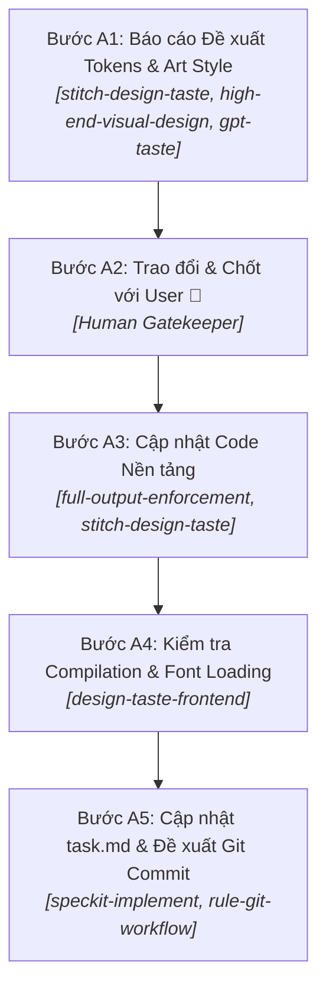

# QUY TRÌNH THỰC HIỆN GIAO DIỆN - TRACK A: NỀN TẢNG & HẠ TẦNG THEME

Tài liệu này định nghĩa quy trình chuẩn (SOP) 5 bước cho các Task thuộc nhóm **Nền tảng, Hệ thống Tokens & Hạ tầng Theme** (T048 - T051, T056 - T057) trong dự án Feed The Kraken.

---

## 1. Phạm Vi Áp Dụng (Scope)
- **Các Task áp dụng:** T048 (Design Tokens, Palette, Fonts), T049 (Dark Wood / Parchment Cards), T050 (Buttons, Inputs, Modals), T051 (Responsive Grid Layouts), T056 (Sound Effects & Music Hooks), T057 (Animations & Physics Keyframes).
- **Đặc trưng:** Là các thay đổi cốt lõi trên stylesheet toàn cục (`tailwind.config.js`, `index.css`, `index.html`, theme contexts), không tạo mockups toàn cảnh mà tập trung vào cấu trúc tokens và hệ thống dùng chung.

---

## 2. Chi Tiết 5 Bước Thực Hiện

### Bước A1: Báo Cáo Đề Xuất Hệ Thống Tokens & Art Style
- **Skills kích hoạt:**
  - `stitch-design-taste`: Thiết kế bảng Design Tokens ngữ nghĩa (Semantic Tokens), phân bổ bảng màu HSL/HEX cổ điển (`--abyss`, `--hull`, `--parchment`, `--verdigris`, `--sailor`, `--pirate`, `--cult`), xây dựng hệ thống Typography đồng bộ 100% font `'Pirata One'`.
  - `high-end-visual-design`: Thiết lập tiêu chuẩn thẩm mỹ cao cấp (chống giao diện generic AI, định nghĩa độ sâu `boxShadow.wood`, `boxShadow.parchment`, quy chuẩn bo góc sắc cạnh thô mộc `rounded-sm` / `rounded`).
  - `gpt-taste`: Định nghĩa các keyframes chuyển động vật lý có sức nặng (`candleFlicker`, `gunShake`, `shipBob`, `eldritchPulse`, `dustDrift`).
- **Hành động:** Trình bày chi tiết bảng thông số Tokens & Typography vào chat cho User đánh giá.

### Bước A2: Trao Đổi & Chốt với User (CỔNG CHẶN 🎯)
- **Hành động:** Lắng nghe góp ý của User về màu sắc/font chữ/chất liệu. **CHỈ KHI USER CHÍNH THỨC DUYỆT** mới chuyển sang Bước A3.

### Bước A3: Cập Nhật Code Nền Tảng (Implementation)
- **Skills kích hoạt:**
  - `full-output-enforcement`: Đảm bảo viết đầy đủ 100% tokens, keyframes, font preconnects và utilities trong `tailwind.config.js`, `index.html`, `index.css`, `App.css`, không dùng comment rút gọn hay placeholder.
- **Hành động:** Thực hiện cập nhật mã nguồn theo đúng các tokens đã duyệt.

### Bước A4: Kiểm Tra Build & Font Loading
- **Skills kích hoạt:**
  - `design-taste-frontend` (Pre-flight Audit): Kiểm tra hệ thống tokens CSS biên dịch sạch, fonts load mượt mà, `npm run build` thành công 0 lỗi.

### Bước A5: Cập Nhật task.md & Git Workflow
- **Skills/Rules kích hoạt:**
  - `speckit-implement`: Cập nhật `[x]` trong `task.md`.
  - `rule-git-workflow.md`: Soạn commit message chuẩn Conventional Commits và xin phép User trước khi commit/push.
