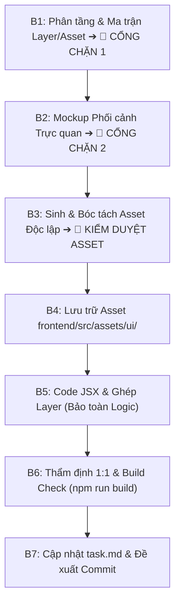

# QUY TRÌNH THỰC HIỆN GIAO DIỆN - TRACK B: TRANG & LINH KIỆN UI CỤ THỂ

Quy trình chuẩn (SOP) 7 bước với **3 Điểm dừng kiểm duyệt bắt buộc** cho toàn bộ Task UI (T052-T055, T058-T068) trong dự án Feed The Kraken.

---

## 1. Nguyên Tắc Cốt Lõi (Core Principles)
1. **Tuân thủ tuần tự 7 bước:** Tuyệt đối không làm gộp hay nhảy cóc. Sau các bước B1, B2, B3 bắt buộc dừng lại trình bày cho User duyệt.
2. **3 Điểm dừng kiểm duyệt bắt buộc:**
   - **Cổng chặn 1 (Sau B1):** Chờ User duyệt Bản phân tầng & Ma trận Asset.
   - **Cổng chặn 2 (Sau B2):** Chờ User duyệt Thiết kế Mockup phối cảnh.
   - **Điểm dừng kiểm duyệt Asset (Sau B3):** Nghiệm thu bộ asset nguyên tử độc lập (100% Alpha, cấm lazy crop) trước khi code.
3. **Cấm code JSX trước khi chốt Asset:** Chỉ code ở Bước B5 sau khi bộ asset B3 đã được nghiệm thu.
4. **Góc nhìn chính thức (Orthographic Top-Down):** Toàn bộ asset mặt bàn, ngăn kéo và đạo cụ phải hiển thị góc nhìn từ trên xuống vuông góc 90 độ (`perpendicular 90° flat lay`), không xiên méo phối cảnh 3D.
5. **Ngôn ngữ hiển thị UI:** 100% Tiếng Anh (`en-US`), font `Pirata One` / `Cinzel`, không dùng stock emoji.

---

## 2. Chi Tiết 7 Bước Thực Hiện

### Bước B1: Phân Tích Phân Tầng & Ma Trận Asset (CỔNG CHẶN 1 🎯)
- **Mục tiêu:** Phân rã cấu trúc giao diện thành các layer Z-Index độc lập và lập ma trận asset trước khi sinh ảnh.
- **Skills kích hoạt:** `image-to-code`, `stitch-design-taste`, `high-end-visual-design`.
- **Hành động bắt buộc:**
  1. **Bản đồ phân tầng Z-Index:** Xác định rõ Layer 0 (Canvas nền buồng cabin), Layer 1 (Bàn gỗ & đạo cụ cố định), Layer 2 (Vùng trung tâm tương tác: MapBoardUI / Action Desk), Layer 3 (Đạo cụ nổi: súng, tiền, cuộn giấy trigger), Layer 4 (Overlay thao tác), Layer 5 (Hộc ngăn kéo gầm bàn), Layer 6 (Modals/HUD).
  2. **Ma trận Asset:** Lập bảng danh mục gồm: Tên Layer/Component, Render Type (JSX/PNG/JPG/SVG), File dự kiến, Z-Index, Tỷ lệ/Anchor, Yêu cầu Alpha Channel.
  3. **CỔNG CHẶN 1 🎯:** Xuất trình bản phân tầng và ma trận vào chat. **DỪNG LẠI CHỜ USER DUYỆT**.

---

### Bước B2: Khởi Tạo Mockup Phối Cảnh & Chốt Thiết Kế (CỔNG CHẶN 2 🎯)
- **Mục tiêu:** Tạo bản vẽ phối cảnh tổng thể thể hiện quan hệ không gian, ánh sáng chiaroscuro, chất liệu gỗ sần và da dê cổ.
- **Skills kích hoạt:** `imagegen-frontend-web`, `image-to-code`, `brandkit`.
- **Hành động bắt buộc:**
  - Sinh ảnh Mockup (Toàn cảnh khoang buồng bàn làm việc, trạng thái mặc định hải đồ, trạng thái cuộn giấy trải đè, trạng thái ngăn kéo mở 2 tab).
  - Xuất trình hình ảnh Mockup và phân tích bố cục cho User xem.
  - **CỔNG CHẶN 2 🎯:** **DỪNG LẠI CHỜ USER DUYỆT THIẾT KẾ**.

---

### Bước B3: Sinh Bộ Asset Nguyên Tử Độc Lập & Tách Phông (KIỂM DUYỆT ASSET 🎯)
- **Quy chuẩn cốt lõi:**
  - Mockup (B2) là bản vẽ phối cảnh tổng quan; Asset (B3) là linh kiện sản xuất độc lập từng lớp để React ghép layer.
  - **NGHIÊM CẤM CẮT CÚP TỪ MOCKUP (STRICT BAN ON LAZY CROPPING):** Cấm tuyệt đối crop đạo cụ, nút bấm hay khung từ ảnh phẳng B2 (gây dính màu nền, răng cưa viền và làm rách canvas phía sau).
- **2 Nhóm Asset bắt buộc tạo mới độc lập:**
  1. **Clean Canvases (Bề mặt nền & Khung chứa sạch):**
     - Nền mặt bàn gỗ (`tabletop_captain_desk.png`), hộc ngăn kéo (`drawer_empty_shell.png`) phải sạch bóng đạo cụ rời.
     - Lòng trong khung trung tâm để trống (clean/transparent) để React JSX render `MapBoardUI` và `Action Desk`, cấm in chết nội dung.
  2. **Standalone Sprites (Đạo cụ & Linh kiện rời - 100% Alpha):**
     - Các phần tử tương tác (cuộn giấy trigger, đĩa la bàn radar, thẻ bài hồ sơ) phải sinh độc lập trên nền đơn sắc trung tính.
     - Dùng script xử lý tách phông kênh Alpha sạch 100%, mép viền mực đen mượt mà, không dính tạp chất nền.
  3. **Góc máy vuông góc 90°:** Bản chính thức bắt buộc góc nhìn thẳng đứng từ trên xuống (orthographic bird's-eye view), bảo toàn độ sắc nét và ánh sáng điện ảnh chiaroscuro.
  4. **Độ phân giải cao:** Asset nền và khung chính đạt chuẩn 2048px+ chống vỡ hình.
- **KIỂM DUYỆT ASSET 🎯:** Xuất trình toàn bộ asset đã tách phông (kèm kích thước, alpha check). **DỪNG LẠI CHỜ USER NGHIỆM THU**. Nghiêm cấm tự ý viết code JSX khi chưa chốt asset.

---

### Bước B4: Lưu Trữ & Tổ Chức Asset Khoa Học
- Phân loại và lưu trữ toàn bộ file PNG nguyên tử vào `frontend/src/assets/ui/`:
  - `backgrounds/`: Nền khoang cabin, mặt bàn gỗ (`tabletop_captain_desk.png`).
  - `frames/`: Hộc ngăn kéo (`drawer_empty_shell.png`), đĩa la bàn (`drawer_radar_base.png`).
  - `sprites/`: Cuộn giấy trigger (`scroll_action_desk_trigger.png`), thẻ bài (`card_crew_dossier.png`), huy hiệu.
  - `buttons/`: Nút bấm bánh lái, nút gỗ embossed.

---

### Bước B5: Code Component & Kỹ Thuật Ghép Layer
- **Skills kích hoạt:** `image-to-code`, `redesign-existing-projects`, `gpt-taste`, `full-output-enforcement`.
- **Quy chuẩn kỹ thuật:**
  - Ghép các layer asset theo đúng Z-Index và vị trí đã hoạch định ở Bước B1.
  - **Bảo toàn 100% Game Logic:** Giữ nguyên toàn bộ React state, props, Socket.io listeners và sound triggers.
  - Thêm hiệu ứng micro-interactions: hover nút bấm, ánh nến lung linh (`candleFlicker`), bụi tro bay (`dustDrift`).
  - Xuất code đầy đủ, không dùng placeholder `/* ... */`.

---

### Bước B6: Thẩm Định Trực Quan 1:1 & Build Check
- **Skills kích hoạt:** `image-to-code`, `design-taste-frontend`.
- **Hành động bắt buộc:**
  - Đối chiếu 1:1 giao diện thực tế với Mockup B2 (mép giấy rách, ánh nến, vân gỗ sần).
  - Kiểm tra responsive (375px đến 1920px+), zero horizontal overflow, 60 FPS, chuẩn tương phản WCAG AA.
  - Chạy lệnh `npm run build` trong `frontend/`, đảm bảo 0 lỗi biên dịch.

---

### Bước B7: Cập Nhật task.md & Đề Xuất Git Workflow
- Đánh dấu hoàn thành task trong `task.md`.
- Lập báo cáo Self-Review theo `rule-code-quality.md`.
- Soạn commit message chuẩn Conventional Commits theo `rule-git-workflow.md` và xin phép User trước khi commit/push.
