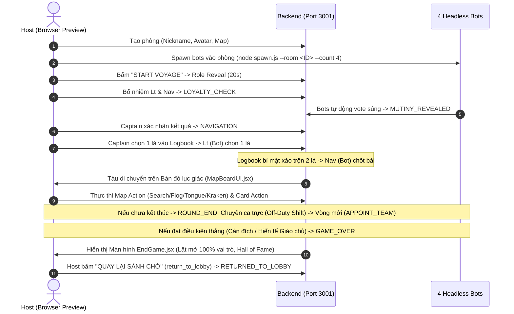

## 🧭 1. TỔNG QUAN & KIẾN TRÚC TEST
Quy trình E2E sử dụng **1 Host (Browser Preview)** phối hợp cùng **4 Headless Bots (`scripts/bots/spawn.js`)** để kiểm thử tự động toàn diện trọn vẹn 100% vòng đời game từ **Phase 1 đến Phase 7**:
- **Phase 1-2 (BR-001):** Tạo phòng, Sảnh chờ (Lobby), Ban đêm (Role Reveal / Pirates Gathering).
- **Phase 3 (BR-002):** Bổ nhiệm Ban điều hướng & Biểu quyết Nổi loạn (Mutiny Voting).
- **Phase 4 (BR-003):** Bốc bài 3 tầng kín, Nhật ký bí mật, Điều hướng & Nhảy tàu (Jump Overboard).
- **Phase 5-6 (BR-004):** Bản đồ lục giác SVG, Di chuyển tàu, Ranh giới tiếp tế (Supply Line), Map Actions (Khám cabin, Đánh roi, Cắt lưỡi, Hiến tế Kraken), Card Effects & Nghi thức Tà giáo (Cult Uprising).
- **Phase 7 (BR-005):** Luân chuyển thẻ Off-Duty, Kiểm tra điều kiện thắng cuộc (Victory Check), Màn hình vinh danh End Game & Lật mở 100% danh tính thật sự, Reset phòng về Sảnh chờ (Return to Lobby).

---

## 🔄 2. SƠ ĐỒ TRÌNH TỰ TỔNG THỂ (MERMAID)

---

## 📋 3. CÁC BƯỚC KIỂM THỬ CHI TIẾT THEO TỪNG GIAI ĐOẠN

### Bước 1: Khởi động Dịch vụ & Tạo Phòng (Bootstrap & Room Creation)
1. Chạy daemon Backend (Port 3001) và Frontend (Port 5173).
2. Mở trình duyệt `http://localhost:5173`, nhập Nickname, chọn Avatar, chọn Bản đồ $\rightarrow$ Bấm **"Create Voyage"**.
3. Đọc `Room Code` từ URL/Header.

### Bước 2: Spawn Bots & Bắt Đầu (Lobby & Night Phase)
1. Chạy bot nền: `node scripts/bots/spawn.js --room <ROOM_CODE> --count 4`.
2. Xác minh sảnh đủ 5/5 người $\rightarrow$ Bấm **"START VOYAGE"**.
3. Xác minh đếm ngược 20s `RoleReveal.jsx` hiển thị đúng vai trò và danh sách đồng bọn Pirate.

### Bước 3: Bổ Nhiệm & Nổi Loạn (Phase 3 - Mutiny Flow)
1. **Appoint Team:** Thuyền trưởng chọn Thuyền phó và Hoa tiêu $\rightarrow$ Bấm Xác nhận.
2. **Loyalty Check:** Đàn Bots tự nộp súng ẩn qua `AutoResponder`.
3. **Mutiny Reveal & Game Pace:** Màn hình lật mở súng. Thuyền trưởng bấm xác nhận để chuyển sang Điều hướng.

### Bước 4: Bốc Bài 3 Tầng & Điều Hướng (Phase 4 - Navigation Flow)
1. **Captain:** Xem 2 lá bài kín $\rightarrow$ Chọn 1 lá vào Nhật ký (`logbookCards`), hủy 1 lá.
2. **Lieutenant (Bot):** Nhận 2 lá tiếp theo qua `emitPrivate` $\rightarrow$ Tự động chọn 1 lá vào Nhật ký.
3. **Logbook Shuffle:** Server tự động xáo trộn 2 lá trong Nhật ký.
4. **Navigator (Bot/Host):** Chọn 1 lá cuối cùng để di chuyển tàu (hoặc thử nghiệm nhánh `JUMP_OVERBOARD` và bổ nhiệm khẩn cấp).

### Bước 5: Di Chuyển Tàu & Bản Đồ Lục Giác (Phase 5 - UC-012)
1. **MapBoardUI.jsx:** Hiển thị lưới lục giác SVG Pointy-topped, đường nối 3 màu (🔴 Đỏ Tây Bắc, 🟡 Vàng Bắc, 🔵 Xanh Đông Bắc), vệt sáng `visitedNodes` và con tàu ⛵ tại node mới.
2. **Supply Line (Map Long):** Tàu cắt qua ranh giới tiếp tế tự động sạc đầy 3 súng cho toàn bộ người chơi active.
3. **Victory Zones:** Cập bến `CRIMSON_COVE`, `KRAKEN_NEST`, hoặc `BLUEWATER_BAY` kích hoạt chiến thắng tương ứng.

### Bước 6: Hành Động Ô Bản Đồ (Phase 6 - UC-013 Map Actions)
1. **Modal `EXECUTE_MAP_ACTION`:** Thuyền trưởng chọn mục tiêu $\rightarrow$ Bấm **"THỰC THI HÀNH ĐỘNG"**:
   - `CABIN_SEARCH`: Thuyền trưởng xem phe thật (hoặc Tentacle 🐙 nếu là Cultist chuyển phe); gán `is_convertible = false`.
   - `FLOGGING`: Broadcast câu loại trừ *"Tôi không phải là [Phe X]"*; gán `is_convertible = false`.
   - `OFF_WITH_THE_TONGUE`: Gán `speech_restricted = true` (khóa chat và tước quyền làm Captain).
   - `FEED_THE_KRAKEN`: Loại bỏ người chơi khỏi tàu. Nếu là `CULT_LEADER` $\rightarrow$ Phe Cult lập tức thắng game!
2. **Game Pace:** Thuyền trưởng bấm **"XÁC NHẬN & TIẾP TỤC HẢI TRÌNH ➔"** (`confirm_map_action`).

### Bước 7: Hiệu Ứng Thẻ Bài (Phase 6 - UC-014 Card Effects)
1. **`DRUNK`:** Chuyển chức Thuyền trưởng theo chiều kim đồng hồ, tự động bỏ qua người bị cắt lưỡi/chết, nhận người `OFF_DUTY`.
2. **`ARMED` / `DISARMED`:** Cộng $+1$ / trừ $-1$ súng của Hoa tiêu đương nhiệm.
3. **`MERMAID`:** Thuyền trưởng chỉ định 1 người $\rightarrow$ Người đó nhận popup riêng xem 3 lá bài hòm bỏ ngẫu nhiên.
4. **`TELESCOPE`:** Thuyền trưởng chỉ định 1 người $\rightarrow$ Người đó nhận popup soi đỉnh Chồng Rút và chọn `KEEP` hoặc `DISCARD`.

### Bước 8: Nghi Thức Tà Giáo (Phase 6 - UC-015 Cult Uprising)
1. Khi lá bài là `CULT_UPRISING`, Thuyền trưởng bấm **"LẬT MỞ BÀI NGHI THỨC"** (rút từ cọc 5 lá `cultRitualDeck`).
2. **`CULT_UPRISING_BLIND`:** Màn đêm toàn cục (Anti-sniffing: không lộ danh tính Giáo chủ).
3. **Quyền Năng Giáo Chủ (`CULT_LEADER`):**
   - `GUNS_STASH`: Cấp 3 súng ẩn danh cho thủy thủ đoàn.
   - `CULT_CABIN_SEARCH`: Thị kiến danh tính thật của Bộ ba Ban điều hướng.
   - `CONVERSION`: Thu nạp 1 người có `is_convertible == true` $\rightarrow$ Nạn nhân nhận thông báo mật `CULTIST_CONVERTED` kèm ID Giáo chủ.

### Bước 9: Chuyển Ca Trực & Bắt Đầu Vòng Mới (Phase 7 - UC-016 Off-Duty Shift)
1. Khi vòng điều hướng và hiệu ứng bài kết thúc, giao diện hiển thị modal **`ROUND_END`** tổng kết vòng chơi.
2. Thuyền trưởng/Người chơi bấm **"BẮT ĐẦU VÒNG TIẾP THEO (CHUYỂN CA TRỰC) ➔"** (`advance_next_round`).
3. **Luân chuyển thẻ Nghỉ Phép (Off-Duty):**
   - Thu hồi thẻ `OFF_DUTY` cũ về trạng thái `ACTIVE` sẵn sàng hoạt động.
   - Gán thẻ `OFF_DUTY` mới theo quy mô phòng:
     - Phòng 5-6 người: Hoa tiêu (Navigator).
     - Phòng 7-8 người: Hoa tiêu + Thuyền phó (Navigator + Lieutenant).
     - Phòng 9-11 người: Thuyền trưởng + Thuyền phó + Hoa tiêu.
   - Reset toàn bộ trạng thái tạm của vòng (phiên mutiny, bài đã chọn, kết quả soi khám) và đưa phòng về giai đoạn `APPOINT_TEAM` để Thuyền trưởng đương nhiệm bổ nhiệm ban điều hướng mới.

### Bước 10: Kiểm Tra Chiến Thắng & Kết Thúc Trận (Phase 7 - UC-017 & UC-018 End Game Flow)
1. **Kích hoạt Điều kiện Thắng (Victory Checks):**
   - **Thủy thủ (SAILOR):** Tàu cập bến vịnh *Bluewater Bay* (`SHIP_REACHED_SAILOR_DESTINATION`).
   - **Hải tặc (PIRATE):** Tàu cập bến sào huyệt *Crimson Cove* (`SHIP_REACHED_PIRATE_DESTINATION`).
   - **Tà giáo (CULT):** Tàu đâm vào *Hang ổ Kraken* (`SHIP_REACHED_CULT_DESTINATION`) HOẶC Giáo chủ bị hiến tế qua `FEED_THE_KRAKEN` (`CULT_LEADER_SACRIFICED_TO_KRAKEN`).
   - *Lưu ý: Navigator tự nhảy tàu (`JUMPED_OVERBOARD`) không kích hoạt chiến thắng cho Tà giáo.*
2. **Đóng Băng Trạng Thái & Lập Bản Ghi GameResult (ENT-006):**
   - Server đóng băng toàn bộ Game State (`status = 'FINISHED'`, `gamePhase = 'END_GAME'`, xóa timers & pending actions).
   - Khởi tạo thực thể `GameResult` chứa snapshot 100% danh tính thật và phát sự kiện `GAME_OVER`.
3. **Màn Hình Vinh Danh & Lật Mở 100% Danh Tính (`EndGame.jsx`):**
   - Hero Banner hoành tráng theo chủ đề phe thắng (Sailor Xanh đại dương, Pirate Đỏ huyết sắc, Cult Tím tà giáo).
   - **Hall of Fame:** Phân bảng rõ ràng **Phe Chiến Thắng (Winners 🏆)** vs **Phe Thua Cuộc (Defeated 💀)**.
   - Hiển thị đầy đủ: Nickname, Avatar, Faction ban đầu $\rightarrow$ Faction cuối cùng, Huy hiệu **👑 Giáo chủ (Cult Leader)**, Huy hiệu **🐙 Cultist đã cải đạo** (kèm lịch sử cải đạo), số súng và trạng thái sống/chết.

### Bước 11: Chủ Phòng Đưa Về Sảnh Chờ (Phase 7 - UC-018 Step 6 Return to Lobby)
1. Chủ phòng (Host) bấm nút **"QUAY LẠI SẢNH CHỜ (CHƠI VÁN MỚI) 🔁"** (`return_to_lobby`).
2. Server dọn dẹp sạch sẽ bàn cờ, bộ bài, chức vụ, phục hồi tất cả người chơi về `status = 'ACTIVE'`, `gunCount = 0`, xóa vai trò và phát sự kiện `RETURNED_TO_LOBBY`.
3. Toàn bộ người chơi trên trình duyệt và headless bots tự động chuyển về giao diện Sảnh chờ (`Lobby.jsx`), sẵn sàng cấu hình bản đồ và bấm **"START VOYAGE"** để bắt đầu ván mới.

---

## 🎯 4. TIÊU CHUẨN NGHIỆM THU (PASS CRITERIA)
- [x] **Lobby & Night (Phase 1-2):** 5/5 người chơi kết nối, hiển thị vai trò bí mật 20s và họp mặt Hải tặc chuẩn xác.
- [x] **Mutiny (Phase 3):** Bổ nhiệm hợp lệ, nộp súng ẩn danh, hiển thị kết quả và Game Pace hoạt động chuẩn.
- [x] **Navigation (Phase 4):** Bốc bài 3 tầng kín, bảo mật `emitPrivate`, xáo trộn Logbook, chốt bài điều hướng, nhảy tàu và bổ nhiệm khẩn cấp thành công.
- [x] **Map & Execution (Phase 5-6):** Tàu di chuyển đúng hướng, Map Actions, Card Effects và Cult Uprising blind phase chạy trơn tru.
- [x] **End Game & Off-Duty (Phase 7):** Luân chuyển thẻ Off-Duty chuẩn theo quy mô phòng; tự động bắt chiến thắng 3 phe; màn hình End Game hiển thị Hall of Fame và lật mở 100% vai trò; Host reset phòng về Lobby thành công.
- [x] **Quality & Tests:** 109/109 Unit Tests passed (27 test suites); 0 lỗi Uncaught Exceptions trên Browser Preview.