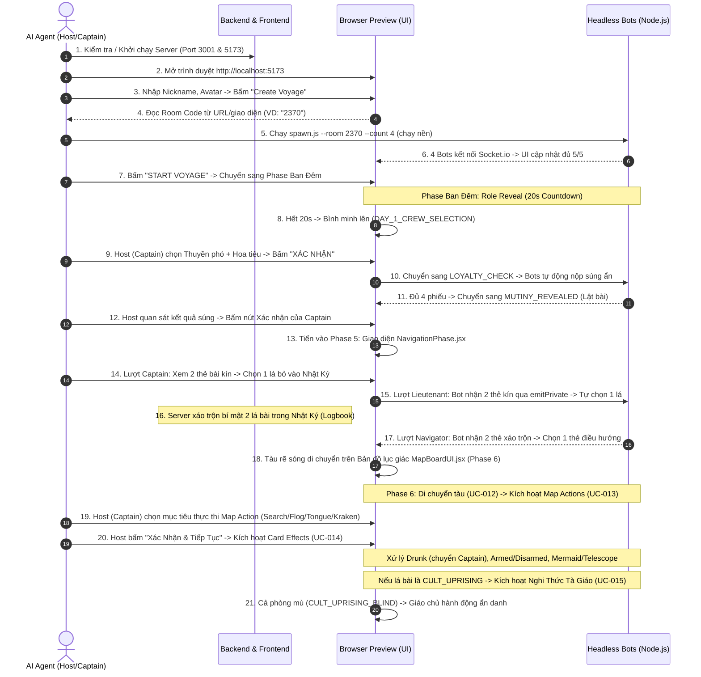

## 🧭 MỤC TIÊU & TỔNG QUAN

Tài liệu này định nghĩa quy trình chuẩn để AI Agent tự động khởi chạy môi trường, mở trình duyệt web (Browser Subagent / Preview), tạo phòng chơi với tư cách là **Host (Human/Captain)**, sử dụng đàn **Headless Bots** để lấp đầy phòng, và tự động kiểm thử toàn diện luồng game từ:
- **Sảnh chờ (Phase 1-3 - BR-001)**
- **Bổ nhiệm Ban điều hướng & Bỏ phiếu Nổi loạn (Phase 4 - BR-002)**
- **Bốc bài Điều hướng, Nhật ký bí mật, và Tự nhảy tàu (Phase 5 - BR-003)**
- **Bản Đồ Lục Giác, Hành Động Ô, Hiệu Ứng Thẻ Bài & Nghi Thức Tà Giáo (Phase 6 - BR-004)**

---

## 🔄 QUY TRÌNH THỰC THI (END-TO-END WORKFLOW)



---

## 📋 CHI TIẾT CÁC BƯỚC KIỂM THỬ

### Bước 1: Khởi chạy môi trường dịch vụ (Service Bootstrap)
Trước khi mở trình duyệt, Agent kiểm tra xem Backend và Frontend đã chạy chưa. Nếu chưa, khởi chạy dưới dạng daemon background tasks:
- **Backend (Port 3001):** `npm run backend:start` hoặc `npm --prefix backend start` (`IsDaemon: true`)
- **Frontend (Port 5173):** `npm run frontend` (`IsDaemon: true`)

---

### Bước 2 & 3: Mở Browser Preview và Tạo Phòng (Host Creation)
Agent gọi tool `browser_subagent` để tương tác với giao diện Web:
1. **Truy cập:** `http://localhost:5173`
2. **Thao tác trên Form Tạo Phòng:**
   - Điền Nickname cho Host (ví dụ: `Captain_Agent` hoặc `TestHost`).
   - Chọn Avatar đại diện (ví dụ: 🧑‍✈️ hoặc 🏴‍☠️).
   - Chọn loại bản đồ (`QUICK_JOURNEY` hoặc `LONG_JOURNEY`).
   - Bấm nút **"Create Voyage"** (hoặc nút Tạo phòng).
3. **Chờ chuyển trang:** Đợi trang web điều hướng vào sảnh chờ `/room/:id`.

---

### Bước 4 & 5: Đọc Room Code và Kích hoạt Headless Bots
1. **Lấy Room Code:** Agent đọc text trên tiêu đề phòng hoặc URL hiện tại (ví dụ: mã phòng `4-6` ký tự như `2370` hoặc `661C`).
2. **Spawn Bots:** Agent gọi `run_command` chạy script bot ở chế độ nền:
   ```bash
   node scripts/bots/spawn.js --room <ROOM_CODE> --count 4
   ```
   *(Số lượng bot phụ thuộc vào kịch bản test, mặc định 4 bots + 1 Host Human = 5 người chơi).*

---

### Bước 6: Xác minh Sảnh chờ (Lobby State Verification)
Agent dùng `browser_subagent` quan sát màn hình sảnh chờ:
- **Số lượng người chơi:** Đảm bảo danh sách hiển thị đủ $5/5$ người chơi (`Captain_Agent` + 4 Bots).
- **Trạng thái kết nối:** Icon/Tên của 4 bots xuất hiện đầy đủ với avatar emoji tương ứng.
- **Kích hoạt nút Bắt đầu:** Nút **"START VOYAGE"** chuyển từ trạng thái `disabled` (bị mờ) sang trạng thái `active` (sáng lên và bấm được).

---

### Bước 7: Kiểm thử Giai đoạn Ban Đêm (Role Reveal & Pirates Gathering)
1. **Bấm "START VOYAGE":** Agent click nút bắt đầu trên Browser Preview.
2. **Xác minh Giao diện `RoleReveal.jsx`:**
   - Host nhìn thấy đúng vai trò bí mật của mình (`SAILOR`, `PIRATE` hoặc `CULT_LEADER`).
   - Nếu là `PIRATE`, hiển thị danh sách các đồng bọn hải tặc.
   - Timer đếm ngược 20s hoạt động đồng bộ. Sau khi hết 20s, màn hình tự động chuyển sang Giai đoạn Ban ngày.

---

### Bước 8: Kiểm thử Bổ nhiệm Ban điều hướng (Phase 4 - Appoint Team)
1. **Giao diện `MutinyBoard.jsx`:**
   - Host (Thuyền trưởng đương nhiệm 👑) thấy bảng chọn Thuyền phó (🎖️) và Hoa tiêu (🧭).
   - Kiểm tra **Smart Filtering**: Thuyền trưởng không thể chọn chính mình; không thể chọn 1 người cho cả 2 vị trí.
2. **Thao tác:**
   - Click chọn 1 Bot làm Thuyền phó (`selectedLt`).
   - Click chọn 1 Bot khác làm Hoa tiêu (`selectedNav`).
   - Nút **"XÁC NHẬN BAN ĐIỀU HƯỚNG"** sáng lên $\rightarrow$ Agent click xác nhận.

---

### Bước 9: Kiểm thử Biểu quyết Nổi loạn (Phase 4 - Loyalty Check / Mutiny Vote)
1. **Chuyển sang `LOYALTY_CHECK`:**
   - Giao diện hiển thị số súng cần thiết để lật đổ (VD: $3$ súng cho phòng 5 người).
   - Đàn Headless Bots qua `AutoResponder` tự động gửi lệnh `submit_mutiny_vote` (chọn ngẫu nhiên $0, 1, 2$ súng sau 0.6 - 1.8s).
   - Grid trạng thái thủy thủ đoàn cập nhật biểu tượng ✅ *"Đã nộp"* cho từng bot.
   - Thuyền trưởng không có quyền vote (hiển thị banner quan sát).

---

### Bước 10: Kiểm thử Lật bài & Xác nhận của Thuyền trưởng (Phase 4 - Mutiny Reveal & Game Pace)
1. **Chuyển sang `MUTINY_REVEALED`:**
   - Màn hình lật mở số súng từng người đã nộp và tổng số súng thu được.
   - Hệ thống **tạm dừng** (không tự động nhảy phase) để người chơi đọc kết quả.
   - Hiển thị Banner kết quả:
     - **Nổi loạn thành công:** Nếu tổng súng $\ge 3$ $\rightarrow$ Hiển thị Tân Thuyền trưởng.
     - **Nổi loạn thất bại:** Nếu tổng súng $< 3$ $\rightarrow$ Thuyền trưởng cũ giữ quyền.
2. **Thao tác của Thuyền trưởng (Hiến pháp Game Pace):**
   - Chỉ Thuyền trưởng (mới hoặc cũ) thấy nút *"TIẾP TỤC HÀNH TRÌNH ĐIỀU HƯỚNG"* hoặc *"BẮT ĐẦU BỔ NHIỆM BAN ĐIỀU HƯỚNG MỚI"*.
   - Agent bấm nút xác nhận $\rightarrow$ Phòng chuyển sang `NAVIGATION` (Giai đoạn Điều hướng).

---

### Bước 11: Kiểm thử Thuyền trưởng Bốc bài (Phase 5 - Captain Draw)
1. **Giao diện `NavigationPhase.jsx`:**
   - Header Bar hiển thị số bài còn lại trong cọc bốc (`drawPileCount`), cọc bỏ (`discardPileCount`) và Nhật ký (`logbookCount: 0/2`).
   - Thuyền trưởng (Host) nhìn thấy 2 lá bài hải đồ bí mật (phối màu Đỏ / Xanh / Vàng với các hiệu ứng `DRUNK`, `ARMED`, `DISARMED`, `MERMAID`, `TELESCOPE`, `CULT_UPRISING` hoặc `NONE`).
   - Các Bot và người xem khác chỉ thấy màn hình chờ: *"Thuyền trưởng đang xem xét hải đồ..."*.
2. **Thao tác của Thuyền trưởng:**
   - Click chọn 1 trong 2 lá bài $\rightarrow$ Lá bài được viền vàng nổi bật.
   - Bấm nút **"XÁC NHẬN BỎ VÀO NHẬT KÝ 📖"**.
   - Lá được chọn đưa vào `logbookCards`, lá còn lại bị hủy úp kín vào `discardPile`.
   - Giao diện chuyển sang lượt của Thuyền phó (`NAVIGATION_LIEUTENANT_DRAW`).

---

### Bước 12: Kiểm thử Thuyền phó Bốc bài (Phase 5 - Lieutenant Draw)
1. **Lượt Thuyền phó (Bot):**
   - Server gửi riêng 2 lá bài tiếp theo qua `emitPrivate(CARDS_DRAWN_SECRET)` chỉ cho Thuyền phó.
   - Bot Thuyền phó qua `AutoResponder.handleCardSelection` tự động chọn 1 lá sau $0.7 - 1.6s$ và gửi `lieutenant_select_card`.
   - Host (Captain) thấy màn hình chờ: *"Thuyền phó đang xem xét hải đồ..."*.
2. **Xáo trộn bí mật (Secret Logbook Shuffle):**
   - Khi Thuyền phó chốt xong lá thứ 2, Server tự động xáo trộn ngẫu nhiên vị trí của 2 lá bài trong `logbookCards`.
   - Chuyển sang lượt của Hoa tiêu (`NAVIGATION_NAVIGATOR_DECISION`).

---

### Bước 13: Kiểm thử Hoa tiêu Định đoạt Hướng đi (Phase 5 - Navigator Decision)
1. **Lượt Hoa tiêu (Bot hoặc Human):**
   - Hoa tiêu nhận thông tin 2 lá bài trong Nhật Ký.
   - **Trường hợp Bot:** `AutoResponder` tự động chọn 1 lá bài phù hợp với phe ẩn và gửi `navigator_select_card`.
   - **Trường hợp Human (nếu Host làm Navigator):**
     - Host thấy 2 lá bài trong Hộp Nhật Ký.
     - Có 2 nút: **"CHỐT ĐIỀU HƯỚNG TÀU 🧭"** hoặc **"TỰ NHẢY TÀU (JUMP OVERBOARD) 🌊"**.
2. **Thực thi Hải đồ:**
   - Hệ thống tự động di chuyển con tàu trên bản đồ và chuyển sang Giai đoạn Bản Đồ & Sự Kiện (`MapBoardUI.jsx`).

---

### Bước 14: Kiểm thử Di Chuyển Tàu & Đồ Thị Bản Đồ Lục Giác (Phase 6 - UC-012)
1. **Giao diện `MapBoardUI.jsx`:**
   - Toàn bộ bản đồ Pointy-topped Hexagonal SVG hiển thị rõ nét với tọa độ node và các đường nối có mũi tên màu sắc (🔴 Đỏ Tây Bắc, 🟡 Vàng Bắc, 🔵 Xanh Đông Bắc).
   - Con tàu ⛵ neo đậu tại Node mới tương ứng với màu bài Hoa tiêu vừa chọn.
   - Đường đi lịch sử được nối liền bằng vệt sáng (`visitedNodes`).
2. **Kiểm thử Tuyến tiếp tế (Supply Line - Map Long):**
   - Khi tàu cắt qua ranh giới tiếp tế ở Long Journey, xác minh toàn bộ người chơi active được sạc đầy $3$ súng.
3. **Kiểm thử Ô Thắng Cuộc (Victory Zones):**
   - Nếu tàu cập bến `CRIMSON_COVE` (Pirate Win), `KRAKEN_NEST` (Cult Win), hoặc `BLUEWATER_BAY` (Sailor Win), xác nhận phòng chuyển sang kết thúc trò chơi.

---

### Bước 15: Kiểm thử Hành Động Ô Bản Đồ (Phase 6 - UC-013 Map Actions)
1. **Giao diện Modal `EXECUTE_MAP_ACTION`:**
   - Khi ô cập bến có Action (`CABIN_SEARCH`, `FLOGGING`, `OFF_WITH_THE_TONGUE`, `FEED_THE_KRAKEN`), Modal nổi lên trên bản đồ.
2. **Thao tác của Thuyền trưởng:**
   - Chọn 1 người chơi từ danh sách thủy thủ đoàn (chặn chọn chính mình, chặn chọn người đã bị loại).
   - Bấm nút **"THỰC THI HÀNH ĐỘNG NGAY"**.
3. **Xác minh Kết quả Hành Động:**
   - **`CABIN_SEARCH`:** Thuyền trưởng thấy phe thật (hoặc Tentacle 🐙 nếu đã chuyển thành Cultist); mục tiêu nhận `is_convertible = false`.
   - **`FLOGGING`:** Cả phòng nhận thông báo câu loại trừ: *"Tôi không phải là [Phe X]"*; mục tiêu nhận `is_convertible = false`.
   - **`OFF_WITH_THE_TONGUE`:** Mục tiêu bị gán `speech_restricted = true` (khóa chat và tước quyền làm Captain).
   - **`FEED_THE_KRAKEN`:** Mục tiêu bị chuyển sang `ELIMINATED`, súng về 0. Nếu mục tiêu là `CULT_LEADER` $\rightarrow$ Phe Tà giáo lập tức thắng game!
4. **Kiểm soát Nhịp độ Game (Game Pace):**
   - Thuyền trưởng bấm nút **"XÁC NHẬN & TIẾP TỤC HẢI TRÌNH ➔"** (`confirm_map_action`) để chuyển sang Giai đoạn Hiệu Ứng Thẻ Bài.

---

### Bước 16: Kiểm thử Hiệu Ứng Thẻ Bài (Phase 6 - UC-014 Card Effects)
1. **`DRUNK` (Say rượu):**
   - Chức Thuyền trưởng tự động xoay theo chiều kim đồng hồ sang người kế tiếp (tự động bỏ qua người bị cắt lưỡi hoặc bị loại; người đang nghỉ phép `OFF_DUTY` vẫn nhận chức hợp lệ).
2. **`ARMED` & `DISARMED`:**
   - Hoa tiêu đương nhiệm nhận thêm $+1$ súng (với `ARMED`) hoặc bị tước $-1$ súng (với `DISARMED`, chặn dưới ở mức 0).
3. **`MERMAID` (Tiếng hát Tiên cá):**
   - Thuyền trưởng chỉ định 1 người chơi $\rightarrow$ Người chơi nhận popup riêng hiển thị 3 lá bài ngẫu nhiên từ Hòm Bỏ (`discard_pile`).
   - Người chơi bấm **"ĐÃ LẮNG NGHE XONG"** để đóng popup.
4. **`TELESCOPE` (Kính viễn vọng):**
   - Thuyền trưởng chỉ định 1 người chơi $\rightarrow$ Người chơi nhận popup riêng soi lá bài đỉnh Chồng Rút (`draw_pile`).
   - Người chơi bấm chọn **"GIỮ TRÊN ĐỈNH (KEEP)"** hoặc **"VỨT VÀO HÒM BỎ (DISCARD)"**.

---

### Bước 17: Kiểm thử Nghi Thức Tà Giáo (Phase 6 - UC-015 Cult Uprising)
1. **Kích hoạt Nghi Thức:**
   - Khi lá bài là `CULT_UPRISING`, Thuyền trưởng bấm **"LẬT MỞ BÀI NGHI THỨC"** từ bộ bài 5 lá `cultRitualDeck`.
2. **Màn Đêm Toàn Cục (`CULT_UPRISING_BLIND`):**
   - Người chơi thông thường thấy màn hình đen tuyền: *"MÀN ĐÊM BUÔNG XUỐNG..."* (Chống lộ danh tính Giáo chủ Anti-Sniffing AC-1).
3. **Quyền Năng Giáo Chủ (`CULT_LEADER`):**
   - **`GUNS_STASH`:** Giáo chủ phân phát đúng 3 khẩu súng cho thủy thủ đoàn $\rightarrow$ Kết thúc đêm, súng được cập nhật ẩn danh (AC-2).
   - **`CULT_CABIN_SEARCH`:** Giáo chủ xem bảng hồ sơ mật danh tính thật của Bộ ba Ban điều hướng $\rightarrow$ Bấm hoàn tất thị kiến.
   - **`CONVERSION`:** Giáo chủ chọn 1 người có `is_convertible == true` $\rightarrow$ Nạn nhân nhận thông báo mật `CULTIST_CONVERTED` kèm danh tính Giáo chủ (AC-3).

---

### Bước 18: Quy trình Tự Sửa Lỗi (Self-Healing Loop) & Dọn dẹp
- Nếu phát hiện lỗi giao diện (CSS vỡ, component không render), lỗi console (`get_console_message`), hoặc lỗi socket:
  - Agent kiểm tra file mã nguồn liên quan (`frontend/src/...` hoặc `backend/src/...`).
  - Sử dụng `replace_file_content` sửa lỗi ngay lập tức.
  - Tải lại trang (F5) hoặc chạy lại luồng test để kiểm tra lại.
- **Dọn dẹp:** Sau khi kiểm thử thành công, Agent tắt tiến trình bot nền (`kill`).

---

## 🎯 TIÊU CHUẨN ĐÁNH GIÁ THÀNH CÔNG (PASS CRITERIA)
- [x] **Lobby (Phase 1-3):** Host tạo phòng, 4 bots vào đủ 5/5, Start Voyage hoạt động.
- [x] **Night Phase:** Lật mở vai trò bí mật và Pirates Gathering trong 20s.
- [x] **Appoint Team (Phase 4):** Captain chọn Thuyền phó và Hoa tiêu hợp lệ.
- [x] **Mutiny Vote (Phase 4):** Bots tự nộp súng ẩn qua `AutoResponder`, UI nhận đủ phiếu.
- [x] **Mutiny Resolution (Phase 4):** Lật bài súng chính xác, tạm dừng cho thảo luận.
- [x] **Game Pace (Phase 4):** Chỉ Captain bấm xác nhận mới chuyển tiếp phase.
- [x] **Captain Card Draw (Phase 5):** Thuyền trưởng bốc 2 lá bí mật, chọn 1 lá vào Logbook, hủy 1 lá.
- [x] **Lieutenant Card Draw (Phase 5):** Thuyền phó nhận 2 lá qua `emitPrivate`, chọn 1 lá vào Logbook.
- [x] **Secret Logbook Shuffle (Phase 5):** 2 lá Logbook được xáo ngẫu nhiên trước khi chuyển cho Hoa tiêu.
- [x] **Navigator Decision & Execution (Phase 5):** Hoa tiêu chốt 1 lá, giao diện chuyển sang `EXECUTE_ACTIONS`.
- [x] **Jump Overboard Handling (Phase 5):** Xử lý loại trừ người chơi, hủy logbook và chọn Emergency Navigator trơn tru.
- [x] **Hexagonal MapBoard UI (Phase 6):** Lưới lục giác SVG, đường nối 3 màu định hướng, hiển thị vị trí tàu và lịch sử đường đi.
- [x] **Map Actions Execution (Phase 6):** Modal Khám xét, Đánh roi, Cắt lưỡi, Tế thần Kraken hoạt động mượt mà với quyền Thuyền trưởng.
- [x] **Game Pace Map Confirmation (Phase 6):** Nút xác nhận của Thuyền trưởng điều phối tiến trình an toàn.
- [x] **Card Effects (Phase 6):** Say rượu chuyển Thuyền trưởng bỏ qua cắt lưỡi/chết; Tiếp/tước súng Hoa tiêu; Popup Tiên cá và Kính viễn vọng hoạt động đúng quyền hạn.
- [x] **Cult Uprising (Phase 6):** Màn đêm toàn cục bảo mật Anti-Sniffing; Giáo chủ phát 3 súng ẩn danh, soi ban điều hướng, thu nạp giáo đồ một chiều.
- [x] **Console & Test Suite:** Không có lỗi Uncaught Exceptions đỏ trên Browser Preview; Toàn bộ 87/87 tests passed 100%.