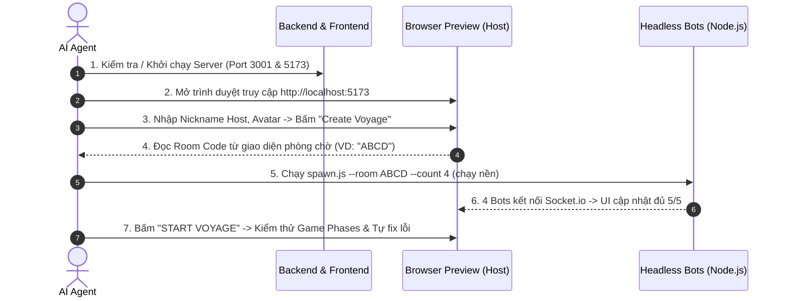

##

Tài liệu này định nghĩa quy trình chuẩn để AI Agent tự động khởi chạy môi trường, mở trình duyệt web (Browser Subagent / Preview), tạo phòng chơi với tư cách là **Host (Human)**, sử dụng đàn **Headless Bots** để lấp đầy phòng, và tự động kiểm thử toàn diện luồng game để phát hiện và sửa lỗi.

---

## 🔄 QUY TRÌNH 7 BƯỚC THỰC THI (7-STEP EXECUTION WORKFLOW)



---

## 📋 CHI TIẾT TỪNG BƯỚC THỰC HIỆN

### Bước 1: Khởi chạy môi trường dịch vụ (Service Bootstrap)
Trước khi mở trình duyệt, Agent kiểm tra xem Backend và Frontend đã chạy chưa. Nếu chưa, khởi chạy dưới dạng daemon background tasks:
- **Backend (Port 3001):** `npm run backend:start` hoặc `npm --prefix backend start` (`IsDaemon: true`)
- **Frontend (Port 5173):** `npm run frontend` (`IsDaemon: true`)

---

### Bước 2 & 3: Mở Browser Preview và Tạo Phòng (Host Creation)
Agent gọi tool `browser_subagent` để tương tác với giao diện Web:
1. **Truy cập:** `http://localhost:5173`
2. **Thao tác trên Form Tạo Phòng:**
   - Điền Nickname cho Host (ví dụ: `Captain_Agent` hoặc `TestHost`).
   - Chọn Avatar đại diện (ví dụ: 🧑‍✈️ hoặc 🏴‍☠️).
   - Chọn loại bản đồ (`QUICK_JOURNEY` hoặc `LONG_JOURNEY`).
   - Bấm nút **"Create Voyage"** (hoặc nút Tạo phòng).
3. **Chờ chuyển trang:** Đợi trang web điều hướng vào sảnh chờ `/room/:id`.

---

### Bước 4 & 5: Đọc Room Code và Kích hoạt Headless Bots
1. **Lấy Room Code:** Agent đọc text trên tiêu đề phòng hoặc URL hiện tại (ví dụ: mã phòng `4-6` ký tự như `AB12` hoặc `661C`).
2. **Spawn Bots:** Agent gọi `run_command` chạy script bot ở chế độ nền:
   ```bash
   node scripts/bots/spawn.js --room <ROOM_CODE> --count 4
   ```
   *(Số lượng bot phụ thuộc vào kịch bản test, mặc định 4 bots + 1 Host Human = 5 người chơi).*

---

### Bước 6: Xác minh Sảnh chờ (Lobby State Verification)
Agent dùng `browser_subagent` quan sát màn hình sảnh chờ:
- **Số lượng người chơi:** Đảm bảo danh sách hiển thị đủ $5/5$ người chơi (`Captain_Agent` + 4 Bots).
- **Trạng thái kết nối:** Icon/Tên của 4 bots xuất hiện đầy đủ với avatar emoji tương ứng.
- **Kích hoạt nút Bắt đầu:** Nút **"START VOYAGE"** chuyển từ trạng thái `disabled` (bị mờ) sang trạng thái `active` (sáng lên và bấm được).

---

### Bước 7: Khởi chạy Game, Soi chiếu AC và Tự sửa lỗi (Game Phase Testing & Self-Healing)
1. **Bấm "START VOYAGE":** Agent click nút bắt đầu trên Browser Preview.
2. **Kiểm tra Phase Ban đêm (Night Phase / Pirates Gathering):**
   - Màn hình chuyển sang giao diện `RoleReveal.jsx`.
   - Host nhìn thấy đúng vai trò bí mật của mình (`SAILOR`, `PIRATE` hoặc `CULT_LEADER`).
   - Nếu là `PIRATE`, hiển thị danh sách các đồng bọn hải tặc.
   - Timer đếm ngược 20s hoạt động đồng bộ.
3. **Kiểm tra Phase Ban ngày (Day Phase / Mutiny & Appointments):**
   - Đàn Bots tự động phản hồi qua `AutoResponder` hoặc Agent có thể gửi lệnh can thiệp qua CLI Sandbox (`manage_task send_input`).
   - Giao diện bàn cờ, nhật ký ván chơi, súng và chức danh cập nhật đúng logic.
4. **Quy trình Tự Sửa Lỗi (Self-Healing Loop):**
   - Nếu phát hiện lỗi giao diện (CSS vỡ, component không render), lỗi console (`get_console_message`), hoặc lỗi socket:
     - Agent kiểm tra file mã nguồn liên quan (`src/...`).
     - Sử dụng `replace_file_content` sửa lỗi ngay lập tức.
     - Tải lại trang (F5) hoặc chạy lại luồng test để kiểm tra lại.
5. **Dọn dẹp (Teardown):**
   - Sau khi test xong, Agent tắt tiến trình bot an toàn (`SIGINT` hoặc gửi lệnh `exit`).

---

## 🎯 TIÊU CHUẨN ĐÁNH GIÁ THÀNH CÔNG (PASS CRITERIA)
- [x] Host tạo phòng và lấy được Room Code hợp lệ.
- [x] Đàn bot kết nối và render lên UI phòng chờ trong $< 3$ giây.
- [x] Bấm "START VOYAGE" chuyển trạng thái mượt mà sang `PLAYING`.
- [x] Không có lỗi console đỏ (Uncaught Exceptions) trên trình duyệt.
- [x] Không bị rò rỉ vai trò của người chơi khác trong `room_state`.