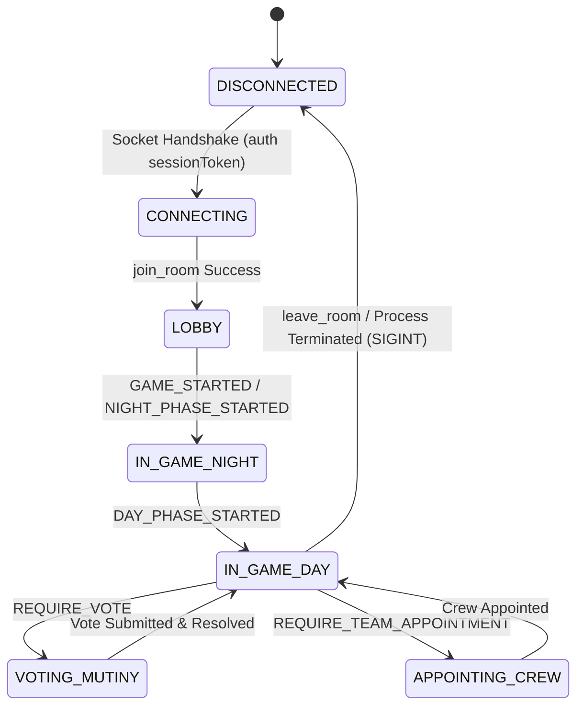

# Data Model: BR-006 Automated Testing Sandbox & Headless Bots

## 1. Overview
Hệ thống Sandbox và Headless Bots hoạt động hoàn toàn ở tầng Client/Scripting trên môi trường Node.js. Các thực thể dữ liệu này được duy trì In-Memory trong tiến trình chạy script.

---

## 2. Core In-Memory Entities

### 2.1. Entity: `BotClient`
Đại diện cho một người chơi ảo độc lập tham gia vào phòng chơi.

| Thuộc tính (Field) | Kiểu dữ liệu (Type) | Mặc định | Mô tả |
| :--- | :--- | :--- | :--- |
| `index` | Integer (1..N) | Auto | Số thứ tự định danh trong Sandbox CLI (ví dụ: Bot 1, Bot 2) |
| `id` | UUID / String | Server assign | Player ID duy nhất được Server cấp sau khi join |
| `nickname` | String | `Bot_${index}` | Tên hiển thị của Bot |
| `avatar` | String (Emoji) | Random | Avatar đại diện (🤖, 🏴‍☠️, ⚓, 🐙...) |
| `sessionToken` | String | `bot_session_<uuid>` | Token định danh bí mật lưu in-memory |
| `socket` | SocketClient | Instance | Kết nối WebSocket Socket.io đang active |
| `roomId` | String | `null` | Mã phòng 6 ký tự mà bot đang tham gia |
| `isHost` | Boolean | `false` | Đánh dấu bot có phải là Host của phòng hay không |
| `secretRole` | Enum / String | `null` | Vai trò ẩn nhận từ sự kiện `ROLE_ASSIGNED` (`SAILOR`, `PIRATE`, `CULT_LEADER`, `CULTIST`) |
| `guns` | Integer | `3` | Số súng hiện có của bot |
| `publicTitles` | Array<String> | `[]` | Các chức danh công khai (`CAPTAIN`, `LIEUTENANT`, `NAVIGATOR`...) |
| `autoMode` | Boolean | `true` | Cờ kích hoạt tự động phản hồi sự kiện |

---

### 2.2. Entity: `BotManager`
Điều phối và quản lý toàn bộ vòng đời của đàn Bots trong một phiên Sandbox.

| Thuộc tính (Field) | Kiểu dữ liệu (Type) | Mô tả |
| :--- | :--- | :--- |
| `serverUrl` | String | URL của Backend Server (mặc định: `http://localhost:3001`) |
| `roomId` | String | Mã phòng mục tiêu |
| `bots` | Map<number, BotClient> | Danh sách các bot được đánh số thứ tự từ 1 đến $N$ |
| `currentRoomState` | Object | Bản sao trạng thái phòng mới nhất nhận từ `room_state` |
| `globalAutoMode` | Boolean | Cờ bật/tắt tự động phản hồi toàn cục |

---

## 3. State Machine & Event Handling Matrix

---

## 4. Invariants (Domain Constraints)
- Mỗi `BotClient` **BẮT BUỘC** phải có một `sessionToken` duy nhất.
- Khi nhận lệnh từ CLI Override Controller, `autoMode` của Bot đó trong lượt hiện tại phải tạm dừng để tránh gửi 2 lần phản hồi lên Server.
- Khi tiến trình nhận tín hiệu `SIGINT` (Ctrl+C), `BotManager` phải gửi sự kiện `leave_room` cho tất cả các bot đang active trước khi thoát.
