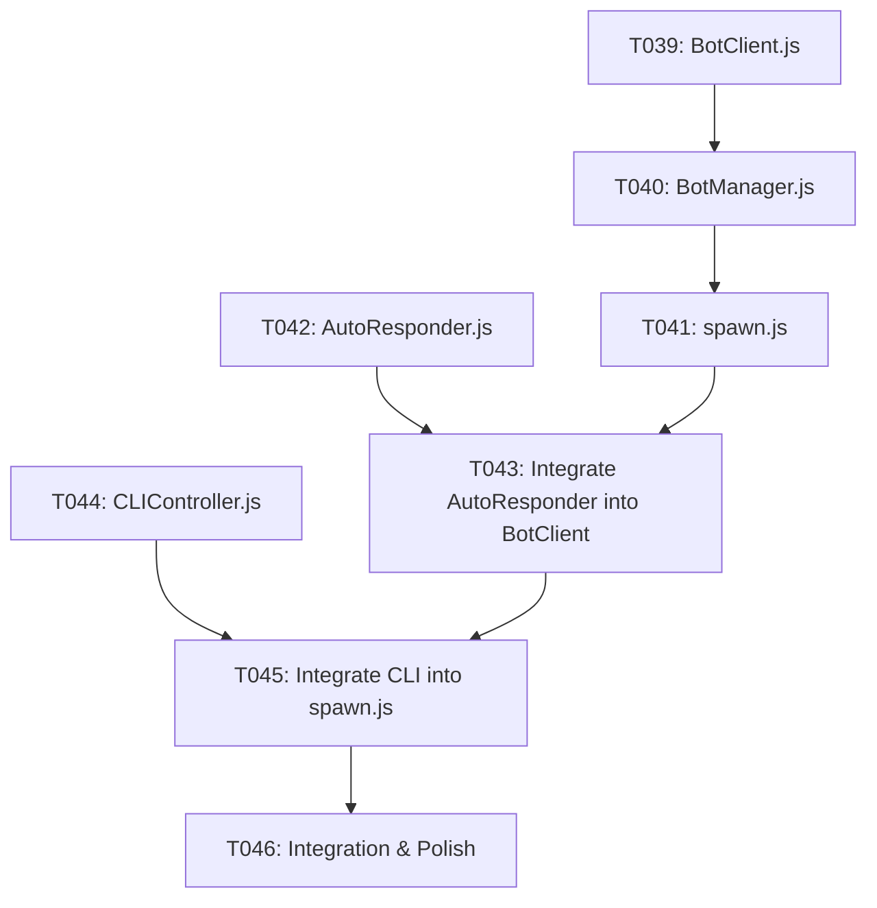

# Tasks: BR-006 Automated Testing Sandbox & Headless Bots

**Input**: Design documents từ `spec/features/006-automated-testing-sandbox/` (`spec.md`, `plan.md`, `research.md`, `data-model.md`, `contracts/cli-contracts.md`, `use-cases/`)

**Prerequisites**: `spec.md`, `plan.md`, `data-model.md`

**Organization**: Tasks được chia theo từng User Story (Use Case) để có thể triển khai và kiểm thử độc lập.

## Format: `- [ ] [TaskID] [P?] [Story?] Description with file path`

- **[P]**: Có thể chạy song song (khác file, không có phụ thuộc)
- **[Story]**: Liên kết với Use Case cụ thể ([US1], [US2], [US3]).

---

## Phase 1: Setup & Bot Lifecycle In-Memory (User Story 1 - UC-018)

**Goal**: Tạo được tiến trình Node.js có thể spawn song song $N$ bots vào sảnh chờ phòng chơi với các kết nối WebSocket và `sessionToken` độc lập hoàn toàn trong bộ nhớ.

**Independent Test**: Chạy `node scripts/bots/spawn.js --room <ROOM_ID> --count 4`, kiểm tra trên UI phòng chờ xuất hiện đủ 5 người chơi và nút "START VOYAGE" được kích hoạt trong $< 3$s.

### Implementation Tasks
- [x] T039 [P] [US1] [BR-006] Tạo `BotClient.js` trong `scripts/bots/BotClient.js` quản lý 1 kết nối WebSocket qua `socket.io-client`, sinh `sessionToken` độc lập in-memory và emit `join_room`.
- [x] T040 [US1] [BR-006] Tạo `BotManager.js` trong `scripts/bots/BotManager.js` để điều phối vòng đời spawn $N$ bots, lưu trữ danh sách bots trong Map, và xử lý graceful shutdown (`SIGINT`).
- [x] T041 [US1] [BR-006] Tạo CLI entrypoint `scripts/bots/spawn.js` nhận tham số `--room <ROOM_ID>` và `--count <N>` từ dòng lệnh.

**Checkpoint**: Có thể dùng script lấp đầy bất kỳ phòng chờ nào từ 1 đến 10 bots chỉ trong 1 dòng lệnh.

---

## Phase 2: Auto-Responder Engine (User Story 2 - UC-019)

**Goal**: Bot tự động lắng nghe các sự kiện từ Server (nhận role ban đêm, biểu quyết Mutiny, bổ nhiệm nhân sự...) và tự động phản hồi dữ liệu hợp lệ kèm delay tự nhiên 500-1500ms để ván game diễn ra liên tục, không bị kẹt (Deadlock).

**Independent Test**: Host bấm Start Game, 4 bots tự động hoàn thành Night Phase và tự động nộp súng khi đến lượt Mutiny Voting mà không cần người can thiệp.

### Implementation Tasks
- [x] T042 [P] [US2] [BR-006] Tạo `AutoResponder.js` trong `scripts/bots/AutoResponder.js` chứa dictionary các handlers cho các sự kiện Server yêu cầu hành động (`REQUIRE_VOTE`, `REQUIRE_TEAM_APPOINTMENT`, `REQUIRE_CARD_DISCARD`...) kèm random delay 500-1500ms.
- [x] T043 [US2] [BR-006] Tích hợp `AutoResponder` vào `BotClient.js` để tự động xử lý và gửi phản hồi hợp lệ về Server khi game chuyển phase.

**Checkpoint**: Game có thể tự động chạy qua các phase biểu quyết và lựa chọn mà không bị dừng lại do thiếu người thao tác.

---

## Phase 3: Interactive CLI Override Controller (User Story 3 - UC-020)

**Goal**: Cung cấp giao diện tương tác terminal cho Tester để có thể xem bảng trạng thái bots (`status`), bật/tắt chế độ tự động (`auto on/off`) và ghi đè hành động của bất kỳ bot nào (`bot <id> vote <guns>`).

**Independent Test**: Gõ `status` hiển thị bảng thông tin bot, gõ `bot 1 vote 3` ép Bot 1 nộp 3 súng và Server ghi nhận đúng 3 súng từ Bot 1.

### Implementation Tasks
- [x] T044 [P] [US3] [BR-006] Tạo `CLIController.js` trong `scripts/bots/CLIController.js` sử dụng Node.js `readline` để nhận lệnh từ `stdin`, parse các lệnh `status`, `bot <id> vote <guns>`, `bot <id> appoint ...`, `auto on/off`.
- [ ] T045 [US3] [BR-006] Tích hợp `CLIController` vào `spawn.js` để mở prompt tương tác `ftk-sandbox > ` ngay sau khi đàn bot join phòng thành công.

**Checkpoint**: Tester có toàn quyền kiểm soát và điều khiển bất kỳ Bot nào trong phòng chơi.

---

## Phase 4: Integration & Polish

**Goal**: Đóng gói công cụ, tạo npm shortcut và kiểm thử toàn diện kịch bản 1 Human + 4 Bots.

### Implementation Tasks
- [ ] T046 [BR-006] Thêm shortcut script `"bot:spawn": "node scripts/bots/spawn.js"` vào `package.json` và kiểm thử toàn bộ luồng tạo phòng, spawn 4 bots, start game và điều khiển qua CLI.

---

## Dependencies & Completion Order

